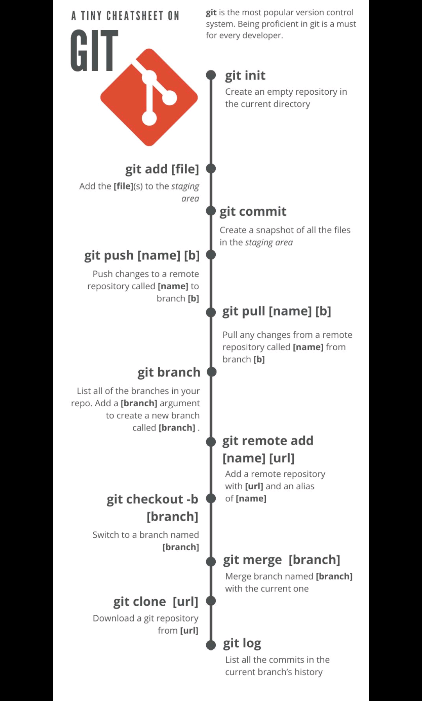

- [Html and css](#html-and-css)
- [React important concepts](#react-important-concepts)
- [React practice problem](#react-practice-problem)
- [HTML, Css questions and answers](#html-css-questions-and-answers)
    - [Q. Ways to center a div?](#q-ways-to-center-a-div)
    - [Q. Media queries?](#q-media-queries)
    - [Q.Css Box model?](#qcss-box-model)
    - [Q. Position?](#q-position)
    - [Q. flexbox?](#q-flexbox)
    - [Q. grid?](#q-grid)
    - [Q.localstorage, session storage, cookie and index db?](#qlocalstorage-session-storage-cookie-and-index-db)
- [React  questions and answers](#react--questions-and-answers)
    - [Q.SPA?](#qspa)
    - [Q. Bundler(webpack and parcel)](#q-bundlerwebpack-and-parcel)
    - [Q.JSX?](#qjsx)
    - [Q. working of dom in react (reconciliation in react)](#q-working-of-dom-in-react-reconciliation-in-react)
    - [Q. ReactDOM.render()?](#q-reactdomrender)
    - [Q. Components?](#q-components)
    - [Q.Stateful and Stateless component?](#qstateful-and-stateless-component)
    - [Q. props?](#q-props)
    - [Q.Props drilling?](#qprops-drilling)
    - [Q.Fragment?](#qfragment)
    - [Q.Phases of a React component's lifecycle](#qphases-of-a-react-components-lifecycle)
    - [Q. Elements vs component?](#q-elements-vs-component)
    - [Q. Contextual rendering](#q-contextual-rendering)
    - [Q. How do we send data from child to parent in react js](#q-how-do-we-send-data-from-child-to-parent-in-react-js)
    - [Q. Build a counter app?](#q-build-a-counter-app)
    - [Q. Add and remove fruit app?](#q-add-and-remove-fruit-app)
    - [Q. Use of key in react](#q-use-of-key-in-react)
    - [Q. Does react re render child components when parent component re renders?](#q-does-react-re-render-child-components-when-parent-component-re-renders)
    - [Q. Pure components?](#q-pure-components)
    - [Q. React memo(Component, arePropsEqual?)](#q-react-memocomponent-arepropsequal)
    - [Q. Class component vs functional component?](#q-class-component-vs-functional-component)
    - [Q. Difference between Mounting and rendering?](#q-difference-between-mounting-and-rendering)
    - [Q. Hooks?](#q-hooks)
    - [Q. useState?](#q-usestate)
    - [Q. useEffect?](#q-useeffect)
    - [Q. useContext?](#q-usecontext)
    - [Q.useMemo](#qusememo)
    - [Q. useRef](#q-useref)
    - [Q.Higher-order component?](#qhigher-order-component)
    - [Q. Render-prop?](#q-render-prop)
    - [Q. forwardRef?](#q-forwardref)
    - [Q.Custom Hooks?](#qcustom-hooks)
    - [Q. How do setTimeout react in the useEffect hook?](#q-how-do-settimeout-react-in-the-useeffect-hook)
    - [Q.Context api?](#qcontext-api)
    - [Q.Synthetic Event?](#qsynthetic-event)
    - [Q.React fiber?](#qreact-fiber)
    - [Q. startTransition](#q-starttransition)
    - [Q.Code splitting?](#qcode-splitting)
    - [Q. Lazy-loading components and Suspense](#q-lazy-loading-components-and-suspense)
    - [Q.\<StrictMode\>](#qstrictmode)
    - [Q.Pagination?](#qpagination)
    - [Q.preventDefault()](#qpreventdefault)
    - [Q. Dangerously setting the inner HTML?](#q-dangerously-setting-the-inner-html)
    - [Q. Implementation syntax of React redux](#q-implementation-syntax-of-react-redux)
- [Resources:](#resources)
    - [3 ways to solve functions, arrays, objects recreated on every render.](#3-ways-to-solve-functions-arrays-objects-recreated-on-every-render)
- [Git:](#git)


# Html and css


* form and validation 
* ways to centre a div
* media queries 
* css box model
* position 
* Flex
* grid template and repeat function 
* localstorage, session storage, cookie and index db.


# React important concepts


* spa meaning
* bundler(webpack and parcel)
* Jsx
* working of dom in react (reconciliation in react, virtual dom)
* ReactDOM.render()
* components 
* stateful vs stateless component 
* props
* prop drilling
* fragment
* component lifecycle -  lifecycle events
* element vs component
* contextual rendering
* send data from child to parent 
* counter app
* fruit app
* use of keys in react
* pure component (in class component)
* react memo - memoised component 
* mixins and higher order components (both are used for reusable behaviour that can be shared among multiple components. )
* class based vs functional components
* difference between mounting and rendering 
* Hooks
* useState
* useEffect
* useContext
* useMemo
* useRef
* refs - reference
* higher order components
* render prop
* forward refs
* custom hooks
* how do setTimeout reacts in useEffect hook
* context api
* synthetic events
* react fibre
* startTransition()
* performance optimisation in react
* code splitting
* lazy loading and suspense 
* react strictmode
* react developer tool
* react router - https://www.youtube.com/watch?v=Ul3y1LXxzdU&ab_channel=WebDevSimplified
* handle protected routes
* how to manage nested routes in a role based routing
* redux
* middlewares in redux
* redux thunk vs saga
* interceptor in react
* Axios
* pagination
* preventDefault()
* dengerouslySetInnerHTML
* jwt - json web token


# React practice problem


* Build Counter app
* Shopping cart in react js
* Dark mode - light mode
* file explorer 
* Flatten an array
* Merge sort
* Implement promise.all
* Todo list
* Build a traffic light where the lights switch from green to yellow to red after predetermined intervals and loop indefinitely. Each light should be lit for the following durations:
* Red light: 4000ms
* Yellow light: 500ms
* Green light: 3000ms
* Count number of times a value occurred in an array
* Debounce - limit number of times a function executes, by delaying the execution by specified time.
* Build Tabs component that displays a list of tab elements and one content at a time.
* Build calculator
* Build Holy grail layout- The Holy Grail layout is a famous CSS page layout that has traditionally been hard to implement. It consists of a header, footer, and three columns. The left column contains navigation items, the middle column contains the page contents, and the right column contains ads.
* Build tic tac toe
* Build a component that allows transferring of items between two lists, bulk selection/ deselection of items, and adding of new items.
* Build a slider, on increasing/ decreasing the slider value should reflect in a pieChart.
* Merge two object together.
* Create a stopwatch
* Star Rating- build a stat rating component that shows a row of star icons for users to select the number of filled stars corresponding to the rating.
* Generate a table of numbers given the rows and columns.
* Ability to call an API and parse JSON.
* Ability to handle promises.
* Ability to put data into state and use that to render on the page.
* Basic CSS (flexbox, border styles, background, centering a div on page)
* Ability  to handle events and gather target's value from input boxes (event.target.value)
* Ability to use hooks such as useState, useEffect.
* Ability to pass the right dependency array to useEffect.
* Create an app to fetch data from a JSON API. Use this data to render on the page. Provide ability to paginate the results 
* Create a typeahead component.(autocomplete using array of names)
* Given a mock, use React to render on the page. eg. 10 box are there with a flip button on it to reveal an image on it.
* Infinite scrolling app
* Create a form that gathers user's data and sends it to the server.
* Create a tic tac toe game.
* Create a slideshow type app. The data of slides could be given. It contains an image url, and the title of the slide. Left and Right navigation buttons are needed.
* Create a form app that has a different state of UI when a field is selected, has value or is visited. (Uses onFocus, onBlur events)
* Create a ticker that increments value every second.
* Create an app that allows user to click a button 5 times, and times them out afterwards.
* Create an app that uses debouncing / throttling.


# HTML, Css questions and answers


### Q. Ways to center a div?

-> 


* Using Flexbox (for both horizontal and vertical centering):

```css
.container {
  display: flex;
  justify-content: center; /* Horizontal centering */
  align-items: center; /* Vertical centering */
}
```


* Using CSS Grid (for both horizontal and vertical centering):

```css
.container {
  display: grid;
  place-items: center;
}
```


* Using absolute positioning and transform:

```css
.container {
  position: relative;
}
.centered {
  position: absolute;
  top: 50%;
  left: 50%;
  transform: translate(-50%, -50%);
}
```


* Using margin: auto (for horizontal centering only):

```css
.container {
  width: 50%;
  margin: 0 auto;
}
```


* Using table-cell and vertical-align (for both horizontal and vertical centering):

```css
.container {
  display: table-cell;
  text-align: center; /* Horizontal centering */
  vertical-align: middle; /* Vertical centering */
}
```


* Using grid with justify-items and align-items (for both horizontal and vertical centering):

```css
.container {
  display: grid;
  justify-items: center; /* Horizontal centering */
  align-items: center; /* Vertical centering */
}
```


### Q. Media queries?

-> Media queries are a fundamental component of responsive web design, allowing you to apply different styles to a webpage based on various characteristics of the user's device, such as screen size, orientation, and resolution. They enable you to create a consistent and user-friendly experience across different devices and screen sizes.

Media queries are commonly used in CSS to apply different styles based on the following criteria:


* Screen size: You can define specific styles for different screen widths to ensure that your website looks good on various devices, including desktops, tablets, and smartphones.

```css
@media screen and (max-width: 600px) {
  /* Styles for screens smaller than 600px */
}
```
* Device orientation: You can apply different styles based on the orientation of the device, allowing your layout to adapt to both landscape and portrait modes.

```css
@media (orientation: landscape) {
  /* Styles for landscape orientation */
}
```


* Device resolution: You can target specific device resolutions to ensure that your design looks crisp and well-defined on high-resolution screens.

```css
@media screen and (min-resolution: 300dpi) {
  /* Styles for high-resolution screens */
}
```


By using media queries, you can create a responsive and adaptive layout that provides an optimal viewing experience for users across different devices and screen sizes. Media queries are a crucial tool for modern web development, helping you build websites that are accessible and user-friendly on a wide range of devices and platforms.


### Q.Css Box model?

-> The CSS box model is a fundamental concept in web design that describes the structure of an HTML element as a rectangular box. It consists of several properties that define the content, padding, border, and margin of an element, determining its overall dimensions and layout within the web page. The CSS box model includes the following components:


* Content: It represents the actual content of the element, such as text, images, or other HTML elements.
* Padding: Padding is the space between the content and the element's border. It provides additional space inside the element, separating the content from the border.
* Border: The border is a line that surrounds the padding and content of the element. It can be customised with various styles, colors, and widths.
* Margin: Margin is the space outside the border, providing clearance between the element and other elements in the layout.

The overall size of an element in the CSS box model can be calculated as follows:


```
Total element width = width + (left padding) + (right padding) + (left border) + (right border) + (left margin) + (right margin)
Total element height = height + (top padding) + (bottom padding) + (top border) + (bottom border) + (top margin) + (bottom margin)
```


Understanding the CSS box model is essential for designing and laying out web pages effectively. By properly managing the content, padding, border, and margin properties of elements, you can create visually appealing and well-structured layouts that provide a consistent and intuitive user experience.


### Q. Position?

-> In CSS, the position property is used to specify the positioning behaviour of an element within its containing element or the viewport. The position property can take several values, each of which controls how the element is positioned and interacts with other elements on the page. The different values for the position property are:


* Static: This is the default value. Elements with position: static are positioned according to the normal flow of the document. Top, right, bottom, left, and z-index properties have no effect on statically positioned elements.
* Relative: Elements with position: relative are positioned relative to their normal position. Using the offset properties (top, right, bottom, left) will move the element from its normal position, but the space it originally occupied will still be reserved.
* Absolute: Elements with position: absolute are positioned relative to the nearest positioned ancestor (an ancestor with a position value of anything other than static) or to the containing block. If there is no positioned ancestor, it is positioned relative to the initial containing block (viewport).
* Fixed: Elements with position: fixed are positioned relative to the viewport, meaning they will remain fixed in their position even when the page is scrolled.
* Sticky: Elements with position: sticky are positioned based on the user's scroll position. It behaves like position: relative until the element reaches a specified threshold, at which point it becomes position: fixed.


### Q. flexbox?

-> In CSS, Flexbox (Flexible Box) is a layout model that provides an efficient way to distribute space among items in a container, even when their size is unknown or dynamic. Flexbox is designed to simplify the process of creating flexible and responsive layouts without using float or positioning properties. It offers a more effective way to align, distribute, and reorder elements within a container.

To use Flexbox, you apply the display: flex property to the container (parent) element. This allows the child elements to become flexible items that can be easily manipulated using various Flexbox properties. Some of the key properties used in Flexbox include:


* flex-direction: Defines the direction in which the flex items are placed in the flex container. It can be set to row, row-reverse, column, or column-reverse.
* 
* justify-content: Aligns flex items along the main axis of the flex container. It can be set to flex-start, flex-end, center, space-between, space-around, or space-evenly.
* 
* align-items: Aligns flex items along the cross axis of the flex container. It can be set to stretch, flex-start, flex-end, center, or baseline.
* 
* flex-wrap: Specifies whether flex items should wrap or not if they can't fit in the container along the main axis. It can be set to nowrap, wrap, or wrap-reverse.
* 
* align-content: Aligns multiple lines of flex items along the cross axis. It is similar to align-items but it aligns lines of items instead of individual items.


### Q. grid?

-> CSS Grid Layout, often referred to as CSS Grid, is a two-dimensional layout system that allows you to create complex grid-based layouts in CSS. It provides a powerful and intuitive way to design web layouts by dividing a webpage into rows and columns, making it easier to position and align elements within the grid.

Key features of CSS Grid include:


* Grid Container and Grid Items: CSS Grid involves two main components - the grid container and grid items. The grid container is the parent element that holds the grid items, which are the children elements that are positioned within the grid.
* Grid Lines and Tracks: Grid lines are the horizontal and vertical lines that divide the grid into rows and columns. Tracks are the spaces between the grid lines where grid items are placed.
* Grid Areas: Grid areas are rectangular spaces within the grid layout that can contain one or more grid items. They can be defined using the grid-template-areas property.
* Explicit and Implicit Grids: CSS Grid allows you to create both explicit and implicit grids. Explicit grids are defined explicitly using the grid-template-rows and grid-template-columns properties, while implicit grids are generated automatically based on the content.
* Alignment and Distribution: CSS Grid provides various properties for aligning and distributing grid items, such as justify-items, align-items, justify-content, and align-content.


### Q.localstorage, session storage, cookie and index db?

->


* localStorage:
    * Stores data with no expiration date.
    * The data persists even when the browser is closed and reopened.
    * Accessed via the localStorage object in the browser.
* sessionStorage:
    * Stores data for a single session, meaning the data is lost when the tab or window is closed.
    * Accessed via the sessionStorage object in the browser.
    * Useful for storing temporary data that should be cleared when the session ends.
* Cookies:
    * Small pieces of data stored in the browser.
    * Typically used for session management, user personalization, and tracking.
    * Can be set to expire after a specific period or when the browser is closed.
* IndexedDB:
    * A low-level API for client-side storage of significant amounts of structured data.
    * Provides a more powerful and flexible way to store data than localStorage or cookies.
    * Ideal for applications that require complex data querying and indexing.

Each of these storage mechanisms has its strengths and limitations, and the choice of which one to use depends on the specific requirements of the application. It's important to consider factors such as data size, data persistence, data structure, and security when selecting the appropriate storage solution for your web application.


# React  questions and answers  

https://www.newline.co/fullstack-react/30-days-of-react/

https://www.educative.io/courses/building-teslas-battery-range-calculator-with-react-and-redux


### Q.SPA?

-> SPA stands for Single Page Application. It is a type of web application that operates within a single HTML page where the content is dynamically updated as the user interacts with the application. In an SPA, the entire page does not reload during use, providing a more fluid user experience similar to that of a desktop application.

Key features of SPAs include:


1. Dynamic Updates: SPAs use JavaScript to dynamically update the content of the web page in response to user actions, eliminating the need for full page reloads.
2. Smooth User Experience: By avoiding full page reloads, SPAs can provide a more seamless and responsive user experience, reducing latency and enhancing interactivity.
3. Client-Side Rendering: SPAs often perform rendering on the client side, utilising JavaScript frameworks like React, Angular, or Vue.js to manage the UI and handle data updates.
4. RESTful APIs: SPAs commonly interact with backend servers through RESTful APIs, enabling data retrieval and manipulation without requiring full page refreshes.
5. URL Routing: SPAs can use client-side routing to update the URL without triggering a server request. This allows users to bookmark and share specific application states.
6. Fast Performance: SPAs can offer improved performance as they do not need to reload the entire page, reducing the amount of data transferred and minimising server requests.


### Q. Bundler(webpack and parcel)

-> Bundlers such as Webpack and Parcel are essential tools in modern web development, used to manage and optimise the deployment of web applications by bundling various assets like JavaScript, CSS, and images. They help streamline the development process by handling tasks such as code transformation, module bundling, and asset optimization. Here's a brief overview of both Webpack and Parcel:


* Webpack:

Webpack is a powerful and popular open-source JavaScript module bundler that enables developers to build and bundle assets for the web. It offers extensive configuration options, allowing users to define custom build processes and handle complex workflows. Webpack can handle various types of assets, including JavaScript, CSS, and images, and it has a robust plugin system that enables integration with various tools and frameworks.


* Parcel:

Parcel is another open-source web application bundler that aims to simplify the development process by providing zero-configuration and out-of-the-box support for various file types. It offers a fast and easy setup, making it a popular choice for quick prototyping and simple web projects. Parcel supports various asset types, including JavaScript, CSS, HTML, and more, and it automatically resolves dependencies and optimises the build process without the need for extensive configuration.

Both Webpack and Parcel are widely used in the JavaScript ecosystem, with each offering its unique set of features and advantages. Webpack is favoured for its extensive customization options and robust plugin ecosystem, making it suitable for complex and large-scale projects. On the other hand, Parcel is known for its simplicity and quick setup, making it an excellent choice for small to medium-sized projects and rapid prototyping.


### Q.JSX?

-> JSX (JavaScript XML) is a syntax extension for JavaScript that allows you to write HTML-like code in your JavaScript files. It provides a way to describe the structure of the UI in a more declarative and intuitive manner, making it easier to work with and visualise complex UI components.

Here are some key features of JSX:


1. HTML-like Syntax: JSX resembles HTML syntax and allows you to write elements and components in a format that closely resembles HTML, making it more intuitive and familiar for web developers.
2. Embedding Expressions: JSX allows you to embed JavaScript expressions within curly braces {}. This enables dynamic content rendering, variable interpolation, and conditional rendering directly within the JSX code.
3. Component Rendering: JSX allows you to define and render React components in a straightforward and concise manner. You can use custom components alongside built-in HTML elements to create complex UIs.
4. Attribute Syntax: JSX uses a familiar attribute syntax similar to HTML, making it easy to set element attributes, event handlers, and other properties directly within the JSX code.

### Q. Phases of react.
->
Conceptually, React does work in two phases:
- Render phase and
- Commit phase

  
- The render phase determines what changes need to be made to e.g. the DOM. During this phase, React calls render and then compares the result to the previous render.
- The commit phase is when React applies any changes. (In the case of React DOM, this is when React inserts, updates, and removes DOM nodes.) React also calls lifecycles like componentDidMount and componentDidUpdate during this phase.

Before your components are displayed on screen, they must be rendered by React. Understanding the steps in this process will help you think about how your code executes and explain its behavior.
Imagine that your components are cooks in the kitchen, assembling tasty dishes from ingredients. In this scenario, React is the waiter who puts in requests from customers and brings them their orders. This process of requesting and serving UI has three steps:

- Triggering a render (delivering the guest’s order to the kitchen)
- Rendering the component (preparing the order in the kitchen)
- Committing to the DOM (placing the order on the table)

“Rendering” is React calling your components.

- On initial render, React will call the root component.
- For subsequent renders, React will call the function component whose state update triggered the render.
  
This process is recursive: if the updated component returns some other component, React will render that component next, and if that component also returns something, it will render that component next, and so on. The process will continue until there are no more nested components and React knows exactly what should be displayed on screen.

- During the initial render, React will create the DOM nodes for every elements.
- During a re-render, React will calculate which of their properties, if any, have changed since the previous render. It won’t do anything with that information until the next step, the commit phase.

After rendering (calling) your components, React will modify the DOM.

- For the initial render, React will use the appendChild() DOM API to put all the DOM nodes it has created on screen.
- For re-renders, React will apply the minimal necessary operations (calculated while rendering!) to make the DOM match the latest rendering output.
  
React only changes the DOM nodes if there’s a difference between renders. 

After rendering is done and React updated the DOM, the browser will repaint the screen. Although this process is known as “browser rendering”

### Q. working of dom in react (reconciliation in react)

-> In React, the virtual DOM and the process of reconciliation play a crucial role in efficiently updating and rendering the actual DOM. Understanding how React handles the DOM is essential for building performant and responsive web applications.

Here's an overview of the working of the DOM and the reconciliation process in React:


1. Virtual DOM:

    React maintains a lightweight representation of the actual DOM known as the virtual DOM. Any time there is a change in the state or props of a component, React first updates the virtual DOM, which is a JavaScript object representing the desired structure of the UI.

2. Reconciliation:

    When the virtual DOM is updated, React performs a process called reconciliation, where it calculates the most efficient way to update the actual DOM. During reconciliation, React compares the new virtual DOM with the previous one and identifies the minimal set of changes required to update the actual DOM.


    FIBRE is ground up rewrite of reconciliation algorithm.

3. Diffing Algorithm:

    React uses a diffing algorithm during reconciliation to efficiently update the DOM. It compares the new virtual DOM with the previous one and identifies the differences between them. This process optimises the performance by minimising the number of updates needed to reflect the changes in the UI.

4. Updating the DOM:

    After completing the reconciliation process, React updates the actual DOM to reflect the changes in the virtual DOM. It only applies the necessary changes to the real DOM, avoiding unnecessary re-renders and improving the overall performance of the application.


By leveraging the virtual DOM and the reconciliation process, React efficiently updates the UI in response to changes in the application state or props. This approach allows developers to build complex and dynamic user interfaces while maintaining high performance and responsiveness.


### Q. ReactDOM.render()?

-> This method is used to render React elements into the DOM. It takes a React element and a DOM container as arguments and renders the element into the specified container in the DOM.


```javascript
import React from 'react';
import ReactDOM from 'react-dom';

const element = <h1>Hello, world!</h1>;
ReactDOM.render(element, document.getElementById('root'));
```


### Q. Components?

-> Components are the building blocks of user interfaces. They allow you to break down the user interface into small, reusable pieces, making it easier to manage and maintain your code. React components can be thought of as self-contained units that encapsulate specific functionality and UI elements. 


### Q.Stateful and Stateless component?

->


* Stateful:

     A stateful component, also known as a container component, is a type of component in React that manages its own state. It is typically implemented as a class component, although with the introduction of React hooks in recent versions of React, stateful logic can also be implemented in functional components using the useState hook. Stateful components maintain their own internal state, which can be modified over time in response to user actions, lifecycle events, or data changes.

* Stateless:

    Stateless component is a component that can receive data and render it, but does not manage or track changes to that data.


### Q. props?

-> "props" is short for "properties," and they are a way to pass data from a parent component to a child component. 

### Q. Reactive values?
-> In React, "reactive values" refer to the values declared directly inside the component body that:

Participate in the React data flow, and;
Can trigger a re-render of the component when their value changes.
These values include props, state, and any other variables and functions that are used in the component's rendering logic. Values derived from other reactive values are also reactive. These values can change on a re-render and be recalculated during subsequent renders if they are updated.

Reactive values are tracked by React for changes. When any of these values change, React schedules a re-render of the component so that it can update the output to reflect the new values. For this reason, it's crucial (for hooks that support dependency array) to include all reactive values the hook depends on, in its dependency array. Otherwise, the callback of the hook may not execute when expected.

When using the useEffect() hook for example, you need to specify which reactive values the effect depends on by passing them as an array of dependencies. If any of these dependencies change, the effect will be executed again. If no dependencies are specified, the effect will only be executed once when the component is mounted.

### Q.Reactivity in React?

-> React doesn’t have any inbuilt mechanism for COMPLETE reactivity in action such as observe/track the changes in the data model and thereby updating the behavior and view itself. So, we can say React is not Reactive!

The developer should explicitly call state mutation calls to make it sync with the view. If any side effects need to be run, that must be wrapped in useEffect hook. All the side effects get a chance to run on whenever the component renders. Side effects with any dependency will run only if the dependency has any new value compared to the previous one.

All state update requests within an effect, event handlers are batched, and React may update it in a single go asynchronously.

### Q. Component lifecycle?
- A component mounts when it’s added to the screen.
- A component updates when it receives new props or state, usually in response to an interaction.
- A component unmounts when it’s removed from the screen.

### Q.Props drilling?

-> Props drilling is a term used in React to describe the process of passing props through multiple levels of nested components to reach a deeply nested child component that needs access to the props. It often occurs when there are several layers of nested components, and the data needs to be passed down the component tree. While props drilling is a simple and straightforward way to share data between components, it can lead to issues such as reduced code readability, tight coupling between components, and the need to update many components when the data changes.

To mitigate the issues associated with props drilling, you can consider implementing one of the following solutions:


* Use Context API: React's Context API allows you to share data without passing props explicitly at every level. It provides a way to pass data through the component tree without having to pass props down manually at every level.
* State Management Libraries: State management libraries such as Redux, MobX, or Recoil can help manage application state in a centralised store, making it accessible to any component without the need for props drilling.
* Component Composition: Rather than passing props through multiple layers, you can use component composition techniques such as render props or higher-order components to encapsulate the logic and pass data to the components that need it directly.

By implementing one of these solutions, you can reduce the complexity of passing props down multiple levels and create a more maintainable and scalable React application.


### Q.Fragment?

-> Use Fragment, or the equivalent &lt;>...&lt;/> syntax, to group multiple elements together. You can use it to put multiple elements in any place where a single element can go. For example, a component can only return one element, but by using a Fragment you can group multiple elements together and then return them as a group:


```javascript
function Post() {
  return (
    <>
      <PostTitle />
      <PostBody />
    </>
  );
}
```


Fragments are useful because grouping elements with a Fragment has no effect on layout or styles, unlike if you wrapped the elements in another container like a DOM element. Also it can't be seen when inspecting the console.

Rendering a list of Fragments:

Here’s a situation where you need to write Fragment explicitly instead of using the &lt;>&lt;/> syntax. When you render multiple elements in a loop, you need to assign a key to each element. If the elements within the loop are Fragments, you need to use the normal JSX element syntax in order to provide the key attribute:


```javascript
function Blog() {
  return posts.map(post =>
    <Fragment key={post.id}>
      <PostTitle title={post.title} />
      <PostBody body={post.body} />
    </Fragment>
  );
}
```


### Q.Phases of a React component's lifecycle

-> A React component undergoes three phases in its lifecycle: mounting, updating, and unmounting.


* The mounting phase is when a new component is created and inserted into the DOM or, in other words, when the life of a component begins. This can only happen once, and is often called “initial render.”. (componentDidMount)
* The updating phase is when the component updates or re-renders. This reaction is triggered when the props are updated or when the state is updated or when context updates. This phase can occur multiple times, which is kind of the point of React.(componentDidUpdate)
* The last phase within a component's lifecycle is the unmounting phase, when the component is removed from the DOM.(componentWillUnmount)


### Q. Elements vs component?

-> In the context of web development, especially in frameworks like React, elements and components are key concepts that play different roles in the construction and rendering of user interfaces.


* Elements:

Elements are the smallest building blocks of React applications. They describe what you want to see on the screen. When a component's render method is called, it returns an element, which is a plain JavaScript object representing a DOM node or another component. Elements are the objects that describe what you want to render on the screen, including their attributes, children, and other details.

Here's an example of a React element:


```javascript
const element = <h1>Hello, world!</h1>;
```


* Components:

Components are reusable, independent, and isolated pieces of UI. They are like JavaScript functions that accept input (props) and return React elements describing what should appear on the screen. Components can be class components or function components. They enable you to split the UI into independent, reusable pieces and abstract complex UI into smaller, more manageable parts.

Here's an example of a simple React functional component:


```javascript
const Greeting = (props) => {
  return <h1>Hello, {props.name}!</h1>;
};
```


### Q. Contextual rendering

-> In the context of React, contextual rendering generally refers to the ability to conditionally render components or UI elements based on specific context or conditions within the application. This is often achieved using conditional statements or by leveraging the power of React's component-based architecture. By applying conditional logic within components, developers can dynamically control what is rendered based on the application's state or other relevant factors.

Here's a simple example of contextual rendering in React using the ternary operator:


```javascript
import React, { useState } from 'react';

const App = () => {
  const [isLoggedIn, setLoggedIn] = useState(false);

  return (
    <div>
      {isLoggedIn ? (
        <h1>Welcome, User!</h1>
      ) : (
        <button onClick={() => setLoggedIn(true)}>Log In</button>
      )}
    </div>
  );
};

export default App;
```


### Q. How do we send data from child to parent in react js

-> By using callback function in parent component and passing it to the child component

Example :


```javascript
const ChildComponent = ({ callback }) => {
  const result = 22;
  const returndatatoparent = () => {
    callback(result);
  };

  return (
    <button onClick={returndatatoparent}>
      return data to parent component
    </button>
  );
};

const ParentComponent = () => {
  const [marks, setMarks] = useState();
  return (
    <ChildComponent
      callback={(marks) => {
        setMarks(marks);
      }}
    />
  );
};
```


### Q. Build a counter app?


```javascript
const Counter = () => {
  const [count, setCount] = useState(0);

  const increment = () => {
    setCount((prev) => prev + 1);
  };

  const decrement = () => {
    setCount((prev)=>prev-1);
  };
  
  return (
    <>
      <h1>{count}</h1>
      <button onClick={increment}>Increment</button>
      <button onClick={decrement}>Decrement</button>
    </>
  );
};
```


### Q. Add and remove fruit app?


```javascript
const Fruit = () => {
  const [fruits, setFruit] = useState([]);
  const [input, setInput] = useState("");

  const addFruit = () => {
    setFruit((prev) => {
      return [...prev, input];
    });
    setInput("");
  };

  const removeFruit = () => {
    if (fruits.length > 0) {
      setFruit((prev) => {
        return prev.slice(0, -1);
      });
    }
  };

  const onChangeHandler = (e) => {
    setInput(e.target.value);
  };

  return (
    <>
      {fruits.map((item) => {
        return <h1>{item}</h1>;
      })}
      <input onChange={onChangeHandler} value={input}/>
      <br />
      <br />
      <button onClick={addFruit}> Add Fruit </button>
      <button onClick={removeFruit}> Remove Fruit </button>
    </>
  );
};
```


### Q. Use of key in react

-> React uses the key to match children in the original dom tree with children in the virtual dom tree. Keys help React identify which items have changed, are added, or are removed. 


### Q. Does react re render child components when parent component re renders?

-> In React, when a parent component re-renders, its child components will also re-render by default. This is because when the parent component renders, it may produce new props, state changes, or context updates that can affect the child components. React's reconciliation algorithm ensures that the child components are updated to reflect any changes in the parent component.


### Q. Pure components?

->In React, a pure component is a type of component that extends the React.PureComponent class instead of the regular React.Component class. The main difference between the two is that PureComponent implements a shouldComponentUpdate method with a shallow prop and state comparison. This allows the component to re-render only when its props or state have changed, providing a performance optimization by reducing unnecessary re-renders.

The shouldComponentUpdate method in React.PureComponent performs a shallow comparison between the current and next props and state. If there are no changes detected in the shallow comparison, the component does not re-render, preventing unnecessary updates to the component tree and potentially improving the overall performance of the application.

Here is an example of a simple React.PureComponent:


```javascript
import React from 'react';

class MyPureComponent extends React.PureComponent {
  render() {
    return (
      <div>
        <h1>{this.props.title}</h1>
        <p>{this.props.content}</p>
      </div>
    );
  }
}
```


In this example, MyPureComponent will only re-render when there are changes in its props or state. If the title and content props remain the same, the component will not re-render even if its parent component re-renders.

In functional components, the concept of a pure component is not directly applicable, as functional components do not have built-in mechanisms for managing their own state changes. However, the concept of a pure component, which aims to minimise unnecessary re-renders, can still be applied to functional components using React.memo.


### Q. React memo(Component, arePropsEqual?) 

-> Wrap a component in memo to get a memoized version of that component. This memoized version of your component will usually not be re-rendered when its parent component is re-rendered as long as its props have not changed. But React may still re-render it: memoization is a performance optimization, not a guarantee.


```javascript
import { memo } from 'react';

const SomeComponent = memo(function SomeComponent(props) {
  // ...
});
```


**<span style="text-decoration:underline;">Parameters</span>:**

Component: The component that you want to memoize. The memo does not modify this component, but returns a new, memoized component instead. Any valid React component, including functions and forwardRef components, is accepted.

optional (arePropsEqual): A function that accepts two arguments: the component’s previous props, and its new props. It should return true if the old and new props are equal: that is, if the component will render the same output and behave in the same way with the new props as with the old. Otherwise it should return false. Usually, you will not specify this function. By default, React will compare each prop with Object.is.


**<span style="text-decoration:underline;">Returns:</span>**


memo returns a new React component. It behaves the same as the component provided to memo except that React will not always re-render it when its parent is being re-rendered unless its props have changed.

**<span style="text-decoration:underline;">Usage</span>:**

Skipping re-rendering when props are unchanged 

React normally re-renders a component whenever its parent re-renders. With memo, you can create a component that React will not re-render when its parent re-renders so long as its new props are the same as the old props. Such a component is said to be memoized.

To memoize a component, wrap it in memo and use the value that it returns in place of your original component:


```javascript
const Greeting = memo(function Greeting({ name }) {
  return <h1>Hello, {name}!</h1>;
});

export default Greeting;
```


A React component should always have pure rendering logic. This means that it must return the same output if its props, state, and context haven’t changed. By using memo, you are telling React that your component complies with this requirement, so React doesn’t need to re-render as long as its props haven’t changed. Even with memo, your component will re-render if its own state changes or if a context that it’s using changes.

**<span style="text-decoration:underline;">Minimising props changes: </span>**


When you use memo, your component re-renders whenever any prop is not shallowly equal to what it was previously. This means that React compares every prop in your component with its previous value using the Object.is comparison. Note that Object.is(3, 3) is true, but Object.is({}, {}) is false.

To get the most out of memo, minimise the times that the props change. For example, if the prop is an object, prevent the parent component from re-creating that object every time by using useMemo:


```javascript
function Page() {
  const [name, setName] = useState('Taylor');
  const [age, setAge] = useState(42);

  const person = useMemo(
    () => ({ name, age }),
    [name, age]
  );

  return <Profile person={person} />;
}

const Profile = memo(function Profile({ person }) {
  // ...
});
```


Note: class components can opt into this same behaviour by extending pure component from react


### Q. Class component vs functional component?

-> In React, class components and functional components are two types of components used to create user interfaces. Each has its own syntax, features, and use cases. Here's a brief overview of each type:


* <span style="text-decoration:underline;">Class Components:</span>

Class components are ES6 classes that extend from React.Component. They are the traditional way of creating components in React and have been widely used in the past. Class components have their own local state and lifecycle methods, such as componentDidMount and componentDidUpdate. They are suitable for complex components that require state management, lifecycle methods, and more advanced features.

Example of a class component:


```javascript
import React, { Component } from 'react';

class MyClassComponent extends Component {
  render() {
    return <h1>Hello, I am a class component!</h1>;
  }
}
```


* <span style="text-decoration:underline;">Functional Components:</span>

Functional components are simpler and more lightweight than class components. They are JavaScript functions that accept props as arguments and return React elements. Functional components do not have their own state or lifecycle methods but are commonly used for presenting UI elements based on props.

Example of a functional component:

```javascript
import React from 'react';

const MyFunctionalComponent = (props) => {
  return <h1>Hello, I am a functional component!</h1>;
};
```


With the introduction of React Hooks, functional components can now manage local state and lifecycle aspects as well, making them more powerful and capable of handling complex logic that was previously exclusive to class components. Functional components are preferred for simpler components, while class components are still useful for more complex components that require state management and lifecycle methods.


### Q. Difference between Mounting and rendering?

-> In the context of React components, mounting and rendering are two distinct phases in the component's lifecycle. They represent different stages in the process of creating and displaying components in the user interface.


* Rendering:

Rendering is the process of generating a React element (a virtual representation of a UI component) based on the component's current state and props. It involves creating the virtual DOM elements that represent the component's structure, content, and layout. Rendering is the initial step in presenting the UI on the screen and is performed whenever a component's state or props change.


* Mounting:

Mounting is a specific phase in the lifecycle of a React component that occurs when the component is being initialised and inserted into the DOM for the first time. During the mounting phase, the component is created, constructed, and inserted into the DOM. This phase involves the execution of specific lifecycle methods, such as constructor, render, componentDidMount, and the setup of event listeners or subscriptions.


### Q. Hooks?

-> Hooks are functions that let you “hook into” React state and lifecycle features from function components. Hooks don’t work inside classes — they let you use React without classes. 

Hooks are JavaScript functions, but they impose two additional rules:


* Only call Hooks at the top level. Don’t call Hooks inside loops, conditions, or nested functions.
* Only call Hooks from React function components. Don’t call Hooks from regular JavaScript functions. (There is just one other valid place to call Hooks — your own custom Hooks.)

All hooks in react: 


* Basic Hooks-
* useState
* useEffect
* useContext
* Additional Hooks-
* useReducer
* useCallback
* useMemo
* useRef
* useImperativeHandle
* useLayoutEffect
* useDebugValue
* useDeferredValue
* useTransition
* useId


### Q. useState?

-> useState is a Hook. We call it inside a function component to add some local state to it. React will preserve this state between re-renders. useState returns a pair: the current state value and a function that lets you update it. You can call this function from an event handler or somewhere else. The only argument to useState is the initial state.

```javascript
const [age, setAge] = useState(42);
```


<span style="text-decoration:underline;">useState returns an array with exactly two items:</span>

The current state of this state variable, initially set to the initial state you provided.

The set function that lets you change it to any other value in response to interaction.

To update what’s on the screen, call the set function with some next state:


```javascript
function handleClick() {
  setName('Robin');
}
```


React will store the next state, render your component again with the new values, and update the UI.

The set function returned by useState lets you update the state to a different value and trigger a re-render. 

The set function only updates the state variable for the next render. If you read the state variable after calling the set function, you will still get the old value that was on the screen before your call.

Note: 

Calling the set function does not change the current state in the already executing code:


```javascript
function handleClick() {
  setName('Robin');
  console.log(name); // Still "Taylor"!
}
```


It only affects what useState will return starting from the next render.


### Q. useEffect?

- componentDidMount


```javascript
useEffect(() => {
  //Runs only on the first render
}, []);
```


-componentDidUpdate


```javascript
useEffect(() => {
  //Runs on every render
});
```


and


```javascript
useEffect(() => {
  //Runs on the first render
  //And any time any dependency value changes
}, [prop, state]);
```


-componentDidUnmount


```javascript
useEffect(() => {
 //Return a cleanup function
return()=>{
//Do the cleanup here
}
}, []);
```


-> The Effect Hook, useEffect, adds the ability to perform side effects from a function component. It serves the same purpose as componentDidMount, componentDidUpdate, and componentWillUnmount in React classes, but unified into a single API. 

You’ve likely performed data fetching, subscriptions, or manually changing the DOM from React components before. We call these operations “side effects” (or “effects” for short) because they can affect other components and can’t be done during rendering.

When you call useEffect, you’re telling React to run your “effect” function after flushing changes to the DOM. Effects are declared inside the component so they have access to its props and state. By default, React runs the effects after every render — including the first render. Effects may also optionally specify how to “clean up” after them by returning a function.

https://react.dev/learn/lifecycle-of-reactive-effects

### Q. useContext?

-> useContext is a React Hook that lets you read and subscribe to context from your component.


```javascript
const value = useContext(SomeContext)
```


Call useContext at the top level of your component to read and subscribe to context.


```javascript
import { useContext } from 'react';

function MyComponent() {
  const theme = useContext(ThemeContext);
  // ...
```


Parameters 


    SomeContext: The context that you’ve previously created (will be discussed below) with createContext. The context itself does not hold the information, it only represents the kind of information you can provide or read from components.

Returns 


    useContext returns the context value for the calling component. It is determined as the value passed to the closest SomeContext.Provider above the calling component in the tree. If there is no such provider, then the returned value will be the defaultValue you have passed to createContext for that context. The returned value is always up-to-date. React automatically re-renders components that read some context if it changes.

Usage 

Passing data deeply into the tree.

useContext returns the context value for the context you passed. To determine the context value, React searches the component tree and finds the closest context provider above for that particular context.

To pass context to a Button, wrap it or one of its parent components into the corresponding context provider:

<span style="text-decoration:underline;"> Updating a value via context: </span>


```javascript
import { createContext, useContext, useState } from 'react';

//context is created with default value null
const ThemeContext = createContext(null);

export default function MyApp() {
  const [theme, setTheme] = useState('light');
  return (
    //context is made available to the wrapped components
    //passing context as an string
    <ThemeContext.Provider value={theme}>
      <Form />
      <label>
        <input
          type="checkbox"
          checked={theme === 'dark'}
          onChange={(e) => {
            setTheme(e.target.checked ? 'dark' : 'light')
          }}
        />
        Use dark mode
      </label>
    </ThemeContext.Provider>
  )
}

function Form({ children }) {
  return (
    <Panel title="Welcome">
      <Button>Sign up</Button>
      <Button>Log in</Button>
    </Panel>
  );
}

function Panel({ title, children }) {
  //using useContext hook we can subscribe to ThemeContext context
  const theme = useContext(ThemeContext);
  const className = 'panel-' + theme;
  return (
    <section className={className}>
      <h1>{title}</h1>
      {children}
    </section>
  )
}

function Button({ children }) {
  //using useContext hook we can subscribe to ThemeContext context
  const theme = useContext(ThemeContext);
  const className = 'button-' + theme;
  return (
    <button className={className}>
      {children}
    </button>
  );
}
```


It doesn’t matter how many layers of components there are between the provider and the Button. When a Button anywhere inside of Form calls useContext(ThemeContext), it will receive "dark" as the value.

<span style="text-decoration:underline;">Updating an object via context </span>


```javascript
import { createContext, useContext, useState } from 'react';

const CurrentUserContext = createContext(null);

export default function MyApp() {
  const [currentUser, setCurrentUser] = useState(null);
  return (
    //passing context as an object
    <CurrentUserContext.Provider
      value={{
        currentUser,
        setCurrentUser
      }}
    >
      <Form />
    </CurrentUserContext.Provider>
  );
}

function Form({ children }) {
  return (
    <Panel title="Welcome">
      <LoginButton />
    </Panel>
  );
}

function LoginButton() {
  const {
    currentUser,
    setCurrentUser
  } = useContext(CurrentUserContext);

  if (currentUser !== null) {
    return <p>You logged in as {currentUser.name}.</p>;
  }

  return (
    <Button onClick={() => {
      setCurrentUser({ name: 'Advika' })
    }}>Log in as Advika</Button>
  );
}

function Panel({ title, children }) {
  return (
    <section className="panel">
      <h1>{title}</h1>
      {children}
    </section>
  )
}

function Button({ children, onClick }) {
  return (
    <button className="button" onClick={onClick}>
      {children}
    </button>
  );
}
```


<span style="text-decoration:underline;">Specifying a fallback default value </span>

If React can’t find any providers of that particular context in the parent tree, the context value returned by useContext() will be equal to the default value that you specified when you created that context:


```javascript
const ThemeContext = createContext(null);
```


The default value never changes. If you want to update context, use it with state as described above.

Often, instead of null, there is some more meaningful value you can use as a default, for example:


```javascript
const ThemeContext = createContext('light');
```


This way, if you accidentally render some component without a corresponding provider, it won’t break.

Refer for more:  [useContext – React](https://react.dev/reference/react/useContext)


### Q.useMemo

->useMemo is a React Hook that lets you cache the result of a calculation between re-renders.


```javascript
const cachedValue = useMemo(calculateValue, dependencies)
```


Call useMemo at the top level of your component to cache a calculation between re-renders:


```javascript
import { useMemo } from 'react';

function TodoList({ todos, tab }) {
  const visibleTodos = useMemo(
    () => filterTodos(todos, tab),
    [todos, tab]
  );
  // ...
}
```


<span style="text-decoration:underline;">Parameters </span>


* <span style="text-decoration:underline;">calculateValue:</span> The function calculating the value that you want to cache. It should be pure, should take no arguments, and should return a value of any type. React will call your function during the initial render. On next renders, React will return the same value again if the dependencies have not changed since the last render. Otherwise, it will call calculateValue, return its result, and store it so it can be reused later.
* <span style="text-decoration:underline;">dependencies:</span> The list of all reactive values referenced inside of the calculateValue code. Reactive values include props, state, and all the variables and functions declared directly inside your component body. The list of dependencies must have a constant number of items and be written inline like [dep1, dep2, dep3]. React will compare each dependency with its previous value using the Object.is comparison.

<span style="text-decoration:underline;">Returns </span>


On the initial render, useMemo returns the result of calling calculateValue with no arguments.

During next renders, it will either return an already stored value from the last render (if the dependencies haven’t changed), or call calculateValue again, and return the result that calculateValue has returned.

<span style="text-decoration:underline;">Usage</span>


You need to pass two things to useMemo:


* A calculation function that takes no arguments, like () =>, and returns what you wanted to calculate.
* A list of dependencies including every value within your component that’s used inside your calculation.

    On the initial render, the value you’ll get from useMemo will be the result of calling your calculation.


    On every subsequent render, React will compare the dependencies with the dependencies you passed during the last render. If none of the dependencies have changed (compared with Object.is), useMemo will return the value you already calculated before. Otherwise, React will re-run your calculation and return the new value.


    In other words, useMemo caches a calculation result between re-renders until its dependencies change.


<span style="text-decoration:underline;">Let’s walk through an example to see when this is useful.</span>

By default, React will re-run the entire body of your component every time that it re-renders. For example, if this TodoList updates its state or receives new props from its parent, the filterTodos function will re-run:


```javascript
function TodoList({ todos, tab, theme }) {
  const visibleTodos = filterTodos(todos, tab);
  // ...
}
```


Usually, this isn’t a problem because most calculations are very fast. However, if you’re filtering or transforming a large array, or doing some expensive computation, you might want to skip doing it again if data hasn’t changed. If both todos and tab are the same as they were during the last render, wrapping the calculation in useMemo like earlier lets you reuse visibleTodos you’ve already calculated before.

This type of caching is called memoization.

Note: You should only rely on useMemo as a performance optimization. If your code doesn’t work without it, find the underlying problem and fix it first. Then you may add useMemo to improve performance.

Refer for more: [useMemo – React](https://react.dev/reference/react/useMemo)


### Q. useRef

->useRef is a React Hook that lets you reference a value that’s not needed for rendering.


```javascript
const ref = useRef(initialValue)
```


<span style="text-decoration:underline;">Parameters</span>:

<span style="text-decoration:underline;">initialValue</span>: The value you want the ref object’s current property to be initially. It can be a value of any type. This argument is ignored after the initial render.

<span style="text-decoration:underline;">Returns</span> 

useRef returns an object with a single property:

<span style="text-decoration:underline;">current:</span> Initially, it’s set to the initialValue you have passed. You can later set it to something else. If you pass the ref object to React as a ref attribute to a JSX node, React will set its current property.

On the next render, useRef will return the same object.

Note: 


* You can mutate the ref.current property. Unlike state, it is mutable.
* When you change the ref.current property, React does not re-render your component. React is not aware of when you change it because a ref is a plain JavaScript object.

<span style="text-decoration:underline;">Usage</span>: 

useRef returns a ref object with a single current property initially set to the initial value you provided.

On the next render, useRef will return the same object. You can change its current property to store information and read it later. This might remind you of state, but there is an important difference.

Changing a ref does not trigger a re-render. This means refs are perfect for storing information that doesn’t affect the visual output of your component. For example, if you need to store an interval ID and retrieve it later, you can put it in a ref. To update the value inside the ref, you need to manually change its current property:


```javascript
function handleStartClick() {
  const intervalId = setInterval(() => {
    // ...
  }, 1000);
  intervalRef.current = intervalId;
}
```


Later, you can read that interval ID from the ref so that you can call clear that interval:


```javascript
function handleStopClick() {
  const intervalId = intervalRef.current;
  clearInterval(intervalId);
}
```


By using a ref, you ensure that:

You can store information between re-renders (unlike regular variables, which reset on every render).

Changing it does not trigger a re-render (unlike state variables, which trigger a re-render).

The information is local to each copy of your component (unlike the variables outside, which are shared).

Changing a ref does not trigger a re-render, so refs are not appropriate for storing information you want to display on the screen. Use state for that instead. 

Example:

A stopwatch 

This example uses a combination of state and refs. Both startTime and now are state variables because they are used for rendering. But we also need to hold an interval ID so that we can stop the interval on button press. Since the interval ID is not used for rendering, it’s appropriate to keep it in a ref, and manually update it.


```javascript
import { useState, useRef } from 'react';

export default function Stopwatch() {
  const [startTime, setStartTime] = useState(null);
  const [now, setNow] = useState(null);
  const intervalRef = useRef(null);

  function handleStart() {
    setStartTime(Date.now());
    setNow(Date.now());

    clearInterval(intervalRef.current);
    intervalRef.current = setInterval(() => {
      setNow(Date.now());
    }, 10);
  }

  function handleStop() {
    clearInterval(intervalRef.current);
  }

  let secondsPassed = 0;
  if (startTime != null && now != null) {
    secondsPassed = (now - startTime) / 1000;
  }

  return (
    <>
      <h1>Time passed: {secondsPassed.toFixed(3)}</h1>
      <button onClick={handleStart}>
        Start
      </button>
      <button onClick={handleStop}>
        Stop
      </button>
    </>
  );
}
```


React expects that the body of your component behaves like a pure function:

If the inputs (props, state, and context) are the same, it should return exactly the same JSX.

<span style="text-decoration:underline;">Manipulating the DOM with a ref:</span>

It’s particularly common to use a ref to manipulate the DOM. React has built-in support for this.

First, declare a ref object with an initial value of null:


```javascript
import { useRef } from 'react';

function MyComponent() {
  const inputRef = useRef(null);
  // ...
```


Then pass your ref object as the ref attribute to the JSX of the DOM node you want to manipulate:


```javascript
  // ...
  return <input ref={inputRef} />;
```


After React creates the DOM node and puts it on the screen, React will set the current property of your ref object to that DOM node. Now you can access the &lt;input>’s DOM node and call methods like focus():

 


```javascript
 function handleClick() {
    inputRef.current.focus();
  }
```


React will set the current property back to null when the node is removed from the screen.

Note: We could reuse some stateful logic between components using Higher-order component and render-prop. Custom Hooks also let us do this.


### Q.Higher-order component?

-> A higher-order component is a function that takes a component and returns a new component.


### Q. Render-prop?

-> The term “render prop” refers to a technique for sharing code between React components using a prop whose value is a function. A component with a render prop takes a function that returns a React element and calls it instead of implementing its own render logic. Example: \


```javascript
<Mouse children={mouse => (
  <p>The mouse position is {mouse.x}, {mouse.y}</p>
)}/>
```


### Q. forwardRef?

-> forwardRef lets your component expose a DOM node to the parent component with a ref.


```javascript
const SomeComponent = forwardRef(render)
```


Call forwardRef() to let your component receive a ref and forward it to a child component:


```javascript
import { forwardRef } from 'react';

const MyInput = forwardRef(function MyInput(props, ref) {
  // ...
});
```


<span style="text-decoration:underline;">Parameters</span> 

render: The render function for your component. React calls this function with the props and ref that your component received from its parent. The JSX you return will be the output of your component.

<span style="text-decoration:underline;">Returns</span>

forwardRef returns a React component that you can render in JSX. Unlike React components defined as plain functions, a component returned by forwardRef is also able to receive a ref prop.

Usage:

<span style="text-decoration:underline;">Exposing a DOM node to the parent component :</span>

By default, each component’s DOM nodes are private. However, sometimes it’s useful to expose a DOM node to the parent—for example, to allow focusing it. To opt in, wrap your component definition into forwardRef():


```javascript
import { forwardRef } from 'react';

const MyInput = forwardRef(function MyInput(props, ref) {
  const { label, ...otherProps } = props;
  return (
    <label>
      {label}
      <input {...otherProps} />
    </label>
  );
});
```


You will receive a ref as the second argument after props. Pass it to the DOM node that you want to expose:


```javascript
import { forwardRef } from 'react';

const MyInput = forwardRef(function MyInput(props, ref) {
  const { label, ...otherProps } = props;
  return (
    <label>
      {label}
      <input {...otherProps} ref={ref} />
    </label>
  );
});
```


This lets the parent Form component access the &lt;input> DOM node exposed by MyInput:


```javascript
function Form() {
  const ref = useRef(null);

  function handleClick() {
    ref.current.focus();
  }

  return (
    <form>
      <MyInput label="Enter your name:" ref={ref} />
      <button type="button" onClick={handleClick}>
        Edit
      </button>
    </form>
  );
}
```


This Form component passes a ref to MyInput. The MyInput component forwards that ref to the &lt;input> browser tag. As a result, the Form component can access that &lt;input> DOM node and call focus() on it.


### Q.Custom Hooks?

-> a FriendStatus component that calls the useState and useEffect Hooks to subscribe to a friend’s online status. Let’s say we want to reuse this subscription logic in another component. 


```javascript
import React, { useState, useEffect } from 'react';

function useFriendStatus(friendID) {
  const [isOnline, setIsOnline] = useState(null);

  function handleStatusChange(status) {
    setIsOnline(status.isOnline);
  }

  useEffect(() => {
    ChatAPI.subscribeToFriendStatus(friendID, handleStatusChange);
    return () => {
      ChatAPI.unsubscribeFromFriendStatus(friendID, handleStatusChange);
    };
  });

  return isOnline;
}
```


It takes friendID as an argument, and returns whether our friend is online.

Now we can use it from both components:


```javascript
function FriendStatus(props) {
  const isOnline = useFriendStatus(props.friend.id);

  if (isOnline === null) {
    return 'Loading...';
  }
  return isOnline ? 'Online' : 'Offline';
}
```


```javascript
function FriendListItem(props) {
  const isOnline = useFriendStatus(props.friend.id);

  return (
    <li style={{ color: isOnline ? 'green' : 'black' }}>
      {props.friend.name}
    </li>
  );
}
```


The state of each component is completely independent. Custom Hooks are a way to reuse stateful logic, not state itself. In fact, each call to a Custom Hook has a completely isolated state — so you can even use the same custom Hook twice in one component.

Custom Hooks are more of a convention than a feature. If a function’s name starts with ”use” and it calls other Hooks, we say it is a custom Hook. 


### Q. How do setTimeout react in the useEffect hook?

-> When you use setTimeout within a useEffect hook in React, it can trigger side effects and component updates after a specific delay. The useEffect hook is used for handling side effects in functional components, and it allows you to perform tasks that cannot be done during rendering, such as data fetching, subscriptions, or manually updating the DOM.

Here's an example of how to use setTimeout within a useEffect hook:


```javascript
import React, { useEffect, useState } from 'react';

const MyComponent = () => {
  const [message, setMessage] = useState('');

  useEffect(() => {
    const timer = setTimeout(() => {
      setMessage('Delayed message after 2000ms');
    }, 2000);

    return () => clearTimeout(timer); // Cleanup function to clear the timer
  }, []);

  return <div>{message}</div>;
};

export default MyComponent;
```


In this example, the useEffect hook sets up a setTimeout function that updates the message state after 2000 milliseconds. The cleanup function returned by useEffect is used to clear the timer when the component is unmounted or when the dependencies of the useEffect change.

Using setTimeout within the useEffect hook can be useful for handling delayed actions, animations, or any task that needs to be executed after a specific time interval. It's important to handle cleanup properly to avoid memory leaks or unexpected behaviour when the component unmounts or when the dependencies change.

Make sure to handle any necessary cleanup within the useEffect hook to prevent any memory leaks or unintended behaviour, especially if the timer is meant to continue running after the component unmounts.


### Q.Context api?

-> The Context API is a feature in React that enables you to share data between components without having to explicitly pass props through every level of the component tree. It provides a way to pass data through the component tree without having to manually pass props down at every level.

The Context API consists of two main parts: the Provider and the Consumer.

The Context API is a feature in React that enables you to share data between components without having to explicitly pass props through every level of the component tree. It provides a way to pass data through the component tree without having to manually pass props down at every level.

The Context API consists of two main parts: the Provider and the Consumer.


1. Provider:

The Provider component allows you to wrap a part of your React component tree and provide a value. This value can then be consumed by components nested within the Provider.

2. Consumer:

The Consumer component allows you to consume the value provided by the Provider in any of the nested components, even if they are deeply nested in the component tree.


```javascript
// Creating a context
const MyContext = React.createContext('default value');

// Using the context - Provider
function MyComponent() {
  return (
    <MyContext.Provider value="Hello from Context!">
      <ChildComponent />
    </MyContext.Provider>
  );
}

// Consumer
function ChildComponent() {
  return (
    <MyContext.Consumer>
      {(value) => <p>{value}</p>}
    </MyContext.Consumer>
  );
}


//or also we can use useContext and directly use the context value

function ChildComponent() {
  const value = useContext(MyContext);
  return <p>{value}</p>;
}
```


### Q.Synthetic Event?

-> In React, synthetic events are wrappers around the browser's native events that behave identically across different browsers. React implements its own event system to ensure consistent behaviour, regardless of the user's browser. These synthetic events mimic the behaviour of native events and are instances of SyntheticEvent.

When working with React's event system, you'll often come across synthetic events for various user interactions, such as onClick, onChange, onSubmit, onFocus, and many others. React's synthetic events provide a cross-browser-compatible way to handle user interactions and input.

React's synthetic events work similarly to native events but provide a consistent interface across different browsers, making it easier to work with events in a React application.


### Q.React fiber?

->  React Fiber is an internal reimplementation of the React reconciliation algorithm. It was introduced in React version 16 to enable more flexibility and improve the performance of React applications, especially for larger and more complex component trees.

The primary goals of React Fiber include:

Incremental Rendering: Fiber enables React to split the rendering work into smaller chunks, allowing the browser to handle other tasks like user input and keeping the application responsive during rendering.

Prioritization and Scheduling: Fiber introduces the concept of priority levels to determine which updates are more important and should be processed first. This helps in providing smoother user experiences, especially in interactive applications.

Error Boundaries: Fiber improves the error handling mechanism in React, allowing components to capture and handle errors in their subtree, preventing the entire application from crashing due to a single error.

Improved Support for Asynchronous Rendering: Fiber facilitates the ability to pause, abort, or resume rendering, making it easier to handle asynchronous data fetching, animations, and other time-consuming tasks without blocking the main thread.

While React Fiber introduced significant changes under the hood, it did not alter the public API of React, meaning that developers can continue using React as they did before. The primary purpose of React Fiber is to improve the performance and responsiveness of React applications, especially for complex UIs and heavy workloads, without requiring developers to rewrite their existing code.

The introduction of React Fiber represents React's commitment to providing a more robust and efficient framework for building modern web applications, while maintaining the simplicity and declarative nature that has made React popular among developers.


### Q. startTransition

-> startTransition lets you update the state without blocking the UI.

You can mark a state update as a transition by wrapping it in a startTransition call:


```javascript
import { startTransition } from 'react';

function TabContainer() {
  const [tab, setTab] = useState('about');

  function selectTab(nextTab) {
    startTransition(() => {
      setTab(nextTab);
    });
  }
  // ...
}
```


Transitions let you keep the user interface updates responsive even on slow devices.

With a transition, your UI stays responsive in the middle of a re-render. For example, if the user clicks a tab but then changes their mind and clicks another tab, they can do that without waiting for the first re-render to finish.


### Q.Code splitting?

->Code splitting consists of separating the code into several packages or components that can be loaded on demand or in parallel. This means that they are not loaded until they are needed.

The page still loads the same amount of code, but the difference is because the page may not execute all the code it loads.

The benefits of code splitting are:


* The speed at which a website loads and displays content becomes faster.
* The interaction time improves.
* The percentage of users who abandon the web page without interacting with it decreases.

In practice code splitting is done using Lazy-loading.


### Q. Lazy-loading components and Suspense 

-> Usually, you import components with the static import declaration:


```javascript
import MarkdownPreview from './MarkdownPreview.js';
```


To defer loading this component’s code until it’s rendered for the first time, replace this import with:


```javascript
import { lazy } from 'react';

const MarkdownPreview = lazy(() => import('./MarkdownPreview.js'));
```


This code relies on dynamic import(), which might require support from your bundler or framework. Using this pattern requires that the lazy component you’re importing was exported as the default export.

Now that your component’s code loads on demand, you also need to specify what should be displayed while it is loading. You can do this by wrapping the lazy component or any of its parents into a &lt;Suspense> boundary:


```javascript
<Suspense fallback={<Loading />}>
  <h2>Preview</h2>
  <MarkdownPreview />
 </Suspense>
```


In this example, the code for MarkdownPreview won’t be loaded until you attempt to render it. If MarkdownPreview hasn’t loaded yet, Loading will be shown in its place.

Note:

Do not declare lazy components inside other components:

```javascript
import { lazy } from 'react';

function Editor() {
  // 🔴 Bad: This will cause all state to be reset on re-renders
  const MarkdownPreview = lazy(() => import('./MarkdownPreview.js'));
  // ...
}
```


Instead, always declare them at the top level of your module:


```javascript
import { lazy } from 'react';

// ✅ Good: Declare lazy components outside of your components
const MarkdownPreview = lazy(() => import('./MarkdownPreview.js'));

function Editor() {
  // ...
}
```


### Q.&lt;StrictMode>

->

&lt;StrictMode> lets you find common bugs in your components early during development.


```javascript
<StrictMode>
  <App />
</StrictMode>
```


Use StrictMode to enable additional development behaviours and warnings for the component tree inside:


```javascript
import { StrictMode } from 'react';
import { createRoot } from 'react-dom/client';

const root = createRoot(document.getElementById('root'));
root.render(
  <StrictMode>
    <App />
  </StrictMode>
);
```


Strict Mode enables the following development-only behaviours:


* Your components will re-render an extra time to find bugs caused by impure rendering.
* Your components will re-run Effects an extra time to find bugs caused by missing Effect cleanup.
* Your components will be checked for usage of deprecated APIs.

React assumes that every component you write is a pure function. This means that React components you write must always return the same JSX given the same inputs (props, state, and context).

Components breaking this rule behave unpredictably and cause bugs. To help you find accidentally impure code, Strict Mode calls some of your functions (only the ones that should be pure) twice in development.If a function is pure, running it twice does not change its behaviour because a pure function produces the same result every time. However, if a function is impure (for example, it mutates the data it receives), running it twice tends to be noticeable (that’s what makes it impure!) This helps you spot and fix the bug early.

Some bugs like:


* missing cleanup function in a useEffect could be avoided.
* accidental mutation of props could be avoided.


### Q.Pagination?

-> Implementing pagination in a React application involves managing and displaying a subset of data at a time, typically in response to user interactions like clicking on next or previous buttons. Here's a simple example of how to create a basic pagination component in React:


```javascript
import React, { useState } from 'react';

const data = [...]; // Your data array to be paginated
const PaginationComponent = () => {
  const itemsPerPage = 5; // Number of items to display per page
  const [currentPage, setCurrentPage] = useState(1);
  const indexOfLastItem = currentPage * itemsPerPage;
  const indexOfFirstItem = indexOfLastItem - itemsPerPage;
  const currentItems = data.slice(indexOfFirstItem, indexOfLastItem);
  const pageNumbers = [];

  for (let i = 1; i <= Math.ceil(data.length / itemsPerPage); i++) {
    pageNumbers.push(i);
  }
  const handleClick = (pageNumber) => {
    setCurrentPage(pageNumber);
  };

  return (
    <div>
      <ul>
        {currentItems.map((item, index) => (
          <li key={index}>{item}</li>
        ))}
      </ul>
      <ul>
        {pageNumbers.map((number) => (
          <li key={number} onClick={() => handleClick(number)}>
            {number}
          </li>
        ))}
      </ul>
    </div>
  );
};
export default PaginationComponent;
```


In this example, we assume you have data that you want to display in paginated form. The data array contains all the items, and the itemsPerPage variable specifies how many items to display per page. The currentPage state variable keeps track of the currently active page.

The slice method is used to extract a subset of data based on the current page and items per page. The pageNumbers array is generated based on the total number of items and items per page, and it is used to display the page numbers for navigation.

Clicking on a page number triggers the handleClick function, which updates the current page. Based on the current page, the component displays the corresponding subset of data along with the page numbers for navigation.

You can integrate this pagination component with your data and UI to implement pagination in your React application.


### Q.preventDefault()

-> In React, you can prevent the default behaviour of an event by calling the preventDefault() method on the event object. This is commonly used with event handlers like onClick for links or form submissions to prevent the default action associated with the event, such as navigating to a new page or submitting a form.

Here's an example of how to use preventDefault with an onClick event:


```javascript
import React from 'react';

function MyComponent() {
  const handleClick = (e) => {
    e.preventDefault(); // Prevent the default behaviour of the <a> element
    // Your custom logic here
    console.log('Link clicked, but default behaviour prevented.');
  };

  return (
    <div>
      <a href="https://example.com" onClick={handleClick}>
        Click me (Prevent Default)
      </a>
    </div>
  );
}

export default MyComponent;
```


In this example, when the link is clicked, the handleClick function is called, and within that function, e.preventDefault() is called to prevent the default behaviour of the &lt;a> element, which is navigating to the URL specified in the href attribute.

You can apply the same concept to other event handlers, such as onSubmit for forms or onKeyDown for input elements, to prevent their default behaviours as needed. Just make sure to pass the event object (usually named e or event) as a parameter to the event handler function.


### Q. Dangerously setting the inner HTML?

-> You can pass a raw HTML string to an element like so:

```javascript
const markup = { __html: '<p>some raw html</p>' };
return <div dangerouslySetInnerHTML={markup} />;
```


dangerouslySetInnerHTML: An object of the form { __html: '&lt;p>some html&lt;/p>' } with a raw HTML string inside. Overrides the innerHTML property of the DOM node and displays the passed HTML inside. This should be used with extreme caution! If the HTML inside isn’t trusted (for example, if it’s based on user data), you risk introducing an XSS vulnerability.

Q. Three important react patterns.

->


*  Higher order components.
* Render prop.
* Custom hooks.


### Q. Implementation syntax of React redux


* Create a Redux store with configureStore
    * configureStore accepts a reducer function as a named argument
    * configureStore automatically sets up the store with good default settings
* Provide the Redux store to the React application components
    * Put a React Redux &lt;Provider> component around your &lt;App />
    * Pass the Redux store as &lt;Provider store= {store}>
* Create a Redux "slice" reducer with createSlice
    * Call createSlice with a string name, an initial state, and named reducer functions
    * Reducer functions may "mutate" the state using Immer
    * Export the generated slice reducer and action creators
* Use the React Redux
* useSelector/useDispatch hooks in React
* components
    * Read data from the store with the useSelector hook
    * Get the dispatch function with the useDispatch hook, and dispatch action needed.

### Q. Describe basic flow if redux.

-> 

**Component dispatches an action(an object with type and payload property), reducer(a function that updates the state) receives it, performs the operation and updates the store, components that are subscribed to the store states are notified.**

Redux is a state management library commonly used with React, although it can be used with other frameworks as well. The basic flow of Redux involves actions, reducers, and a store. Here's a simplified overview:

Actions:

Actions are plain JavaScript objects that describe events or user interactions.

They have a type field indicating the type of action and may include additional data.

You can think of an action as an event that describes something that happened in the application.

Example:
```javascript
const increment = {

  type: 'INCREMENT',

  payload: 1,

};
```
Reducers:

Reducers are functions that specify how the application's state changes in response to actions.

They take the current state and an action, and return a new state.

Reducers should be pure functions without side effects.

You can think of a reducer as an event listener which handles events based on the received action (event) type.

Example:
```javascript
const counterReducer = (state = 0, action) => {

  switch (action.type) {

    case 'INCREMENT':

      return state + action.payload;

    default:

      return state;

  }

};
```
Store:

The store holds the application state.

It is created with a root reducer that combines all the reducers.

The store provides methods to dispatch actions, get the current state, and subscribe to changes.

Example:
```javascript
import { createStore } from 'redux';

const store = createStore(counterReducer);
```
**we can break these steps into more detail:**


* Initial setup:
    * A Redux store is created using a root reducer function
    * The store calls the root reducer once, and saves the return value as its initial state
    * When the UI is first rendered, UI components access the current state of the Redux store, and use that data to decide what to render. They also subscribe to any future store updates so they can know if the state has changed.
* Updates:
    * Something happens in the app, such as a user clicking a button
    * The app code dispatches an action to the Redux store, like dispatch({type: 'counter/incremented'})
    * The store runs the reducer function again with the previous state and the current action, and saves the return value as the new state
    * The store notifies all parts of the UI that are subscribed that the store has been updated
    * Each UI component that needs data from the store checks to see if the parts of the state they need have changed.
    * Each component that sees its data has changed forces a re-render with the new data, so it can update what's shown on the screen
    * Here's what that data flow looks like visually:

Redux data flow diagram


### Q.Redux set up
-> 
1. Define reducers,
2. Create a store,
3. Create action creators
4. Tie the store to the react views

### Q. What is a redux middleware?

-> In Redux, a middleware is a piece of software that provides a way to interact with actions and the state that flows through the Redux application. Middleware sits between the action being dispatched and the moment it reaches the reducer. It allows you to perform additional operations, intercept actions, or modify the behavior of the store.

The basic idea is that middleware can extend the functionality of Redux by providing a layer for handling asynchronous operations, logging, or other side effects.

### Q. why redux?

->when we have multiple components that need to share and use the same state, especially if those components are located in different parts of the application. Sometimes this can be solved by "lifting state up" to parent components, but that doesn't always help.

One way to solve this is to extract the shared state from the components, and put it into a centralized location outside the component tree. With this, our component tree becomes a big "view", and any component can access the state or trigger actions, no matter where they are in the tree!

By defining and separating the concepts involved in state management and enforcing rules that maintain independence between views and states, we give our code more structure and maintainability.

This is the basic idea behind Redux: a single centralized place to contain the global state in your application, and specific patterns to follow when updating that state to make the code predictable.

### Q. Middleware?
Middleware provides a third-party extension point between dispatching an action and handing the action off to the reducer:

[ Action ] <-> [ Middleware ] <-> [ Dispatcher ]

Examples of middleware include logging, crash reporting, routing, handling asynchronous requests, etc.

Middleware sits between the action and the reducer. It can listen for all dispatches and execute code with the details of the actions and the current states.


### Q. Thunk

-> It is a middleware that allows us to return function instead of an action, within redux. 

It is a standard way to write async logic inside redux.

### Q.Action creators?
-> An action creator is a function that literally creates an action object. In Redux, action creators simply return an action object and pass the argument value if necessary.
changeWheel action creator sample :

```javascript
const changeWheel = (value) => {
  return {
    type: 'CHANGE_WHEEL',
    value
  }
}
```

These action creators are passed to the dispatch function as the result value, and the dispatch is executed.

```javascript
dispatch(changeWheel(size))
```

# Resources:

react dom, reconciliation, rendering, etc

[https://youtu.be/i793Qm6kv3U?si=vTsnRaQTD8O7GN_B](https://youtu.be/i793Qm6kv3U?si=vTsnRaQTD8O7GN_B)

chai and code react tutorial:

https://youtube.com/playlist?list=PLu71SKxNbfoDqgPchmvIsL4hTnJIrtige&si=D3-JHVyDtisGR5dg

[https://github.com/learning-zone/react-basics](https://github.com/learning-zone/react-basics)

Frontend interview razorpay:

[https://youtu.be/q-ylRxSxGcY?si=wcjC7uMgBmOTBHU6](https://youtu.be/q-ylRxSxGcY?si=wcjC7uMgBmOTBHU6)

[https://github.com/Nahuel61920/30-React-projects-in-30-days](https://github.com/Nahuel61920/30-React-projects-in-30-days)

Built a file explorer in react

[https://youtu.be/20F_KzHPpvI?si=mexec1x85qu-musb](https://youtu.be/20F_KzHPpvI?si=mexec1x85qu-musb)

[https://youtu.be/ixgxx_um8r8?si=8AtryWG3qOEaxGYS](https://youtu.be/ixgxx_um8r8?si=8AtryWG3qOEaxGYS)

Pagination

[https://youtu.be/cBsB7hhOzQI?si=rBQSLM-90irQML7l](https://youtu.be/cBsB7hhOzQI?si=rBQSLM-90irQML7l)

Interview for unacademy 

[https://youtu.be/abbdJ4Yfm54?si=m5FP3PAf7TCGsRmN](https://youtu.be/abbdJ4Yfm54?si=m5FP3PAf7TCGsRmN)

React interview questions

[https://youtube.com/playlist?list=PLGZJDzu5NntRgpuqVtEb9e2tDaRYXRZFG&si=yz0rm5T0VrjH0o4i](https://youtube.com/playlist?list=PLGZJDzu5NntRgpuqVtEb9e2tDaRYXRZFG&si=yz0rm5T0VrjH0o4i)

React mistakes

[https://youtu.be/-yIsQPp31L0?si=S__z5RajCkl1ckoD](https://youtu.be/-yIsQPp31L0?si=S__z5RajCkl1ckoD)

React in depth

[https://youtu.be/za2FZ8QCE18?si=aWeTWjbA_YzZjKRe](https://youtu.be/za2FZ8QCE18?si=aWeTWjbA_YzZjKRe)

Redux

[https://www.youtube.com/watch?v=poQXNp9ItL4&ab_channel=ProgrammingwithMosh](https://www.youtube.com/watch?v=poQXNp9ItL4&ab_channel=ProgrammingwithMosh)

Redux

[https://www.youtube.com/watch?v=3rlUADfuKhQ&list=PLC3y8-rFHvwheJHvseC3I0HuYI2f46oAK&index=3&ab_channel=Codevolution](https://www.youtube.com/watch?v=3rlUADfuKhQ&list=PLC3y8-rFHvwheJHvseC3I0HuYI2f46oAK&index=3&ab_channel=Codevolution)

Redux by hitesh choudhary

[https://www.youtube.com/watch?v=pX0SBJF01EU&ab_channel=HiteshChoudhary](https://www.youtube.com/watch?v=pX0SBJF01EU&ab_channel=HiteshChoudhary)

Redux for beginners(important)

[https://www.youtube.com/watch?v=0W6i5LYKCSI&ab_channel=DipeshMalvia](https://www.youtube.com/watch?v=0W6i5LYKCSI&ab_channel=DipeshMalvia)

Redux thunk (important)

[https://www.youtube.com/watch?v=JDZRfLGNWdc&ab_channel=DipeshMalvia](https://www.youtube.com/watch?v=JDZRfLGNWdc&ab_channel=DipeshMalvia)

Use redux with api call using redux toolkit (redux,redux-thunk)-

[https://www.youtube.com/watch?v=2JBx_06dD1k&ab_channel=PiyushGarg](https://www.youtube.com/watch?v=2JBx_06dD1k&ab_channel=PiyushGarg)

#Some interview questions -

[https://drive.google.com/file/d/1nG7IaU6B1ce9ifmPRQYFv38Uih7oOU_Z/view?usp=drivesdk](https://drive.google.com/file/d/1nG7IaU6B1ce9ifmPRQYFv38Uih7oOU_Z/view?usp=drivesdk)


### 3 ways to solve functions, arrays, objects recreated on every render.

1-put it outside if it not depend on any thing inside component

2-put it inside effect

3-useMemo or useCallback

Tips:

Here's my 3 step breakdown on cracking Frontend Machine Coding rounds.

• Questions pattern

(For longer Interview hours - Logical feature of Apps)


* WhatsApp Web Ul
* Instagram Comments Section
* Design Movies Page
* Design Carrom Board

(For shorter Interview hours - Small Ul components)


* •Dropdown
* Autocomplete
* Multi Select
* Star Ratings

Practice

(99% of the times you'll only need these coding utilities)


* useState
* useEffect
* Context
* Fetch API
* CSS flexbox, positions
* ES6 map, filter, spread, arrow funcs
* setTimeout, setInterval
* Event handling

Mistakes

(Don't waste your time on these)


* Writing Clean code
*  File structure
* Beautifying Ul
* Breaking Ul to 20, 30 useless components

Focus on logical implementation with a working model first. This is what Interviewers care about.


# Git:



