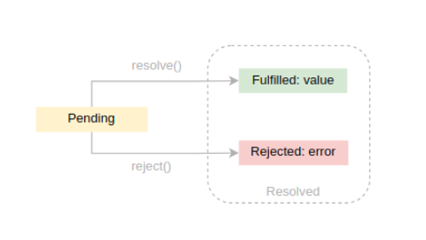

- [Javascript questions and answers](#javascript-questions-and-answers)
    - [Q.What is webpack?](#qwhat-is-webpack)
    - [Q. Tree shaking?](#q-tree-shaking)
    - [Q. What is Babel?](#q-what-is-babel)
    - [Q. Scope?](#q-scope)
    - [Q. Scope chaining or lexical scoping?](#q-scope-chaining-or-lexical-scoping)
    - [Q. Difference between Var, Let and Const?](#q-difference-between-var-let-and-const)
    - [Q. undefined vs null](#q-undefined-vs-null)
    - [Q.Template literals  ${} and  \`\`](#qtemplate-literals---and--)
    - [Q. Object.is()](#q-objectis)
    - [Q. == vs ===](#q--vs-)
    - [Q. Optional chaining?](#q-optional-chaining)
    - [Q.?? (nullish coalescing operator)](#q-nullish-coalescing-operator)
    - [Q. !! Double negation operator?](#q--double-negation-operator)
    - [Q. Deep Copy?](#q-deep-copy)
    - [Q. Shallow Copy](#q-shallow-copy)
    - [Q. Default parameters in a function](#q-default-parameters-in-a-function)
    - [Q. Is javascript pass by value or pass by reference?](#q-is-javascript-pass-by-value-or-pass-by-reference)
    - [Q. Callback Functions](#q-callback-functions)
    - [Q. Timers in javascript](#q-timers-in-javascript)
    - [Q. Destructuring](#q-destructuring)
    - [Q. Spread Syntax](#q-spread-syntax)
    - [Q. Rest Operation?](#q-rest-operation)
    - [Q. Rest Parameters](#q-rest-parameters)
    - [Q. Try/catch](#q-trycatch)
    - [Q. Function statement](#q-function-statement)
    - [Q. Function expression](#q-function-expression)
    - [Q.Difference between function statement and function expression?](#qdifference-between-function-statement-and-function-expression)
    - [Q. Function declaration](#q-function-declaration)
    - [Q. Named function expression](#q-named-function-expression)
    - [Q.Anonymous function?](#qanonymous-function)
    - [Q. Function arguments and function parameters](#q-function-arguments-and-function-parameters)
    - [Q. Higher order functions](#q-higher-order-functions)
    - [Q.Arguments array?](#qarguments-array)
    - [Q. Arrow functions and its advantages?](#q-arrow-functions-and-its-advantages)
    - [Q.Why is it said that the arrow function does not have its own this context?](#qwhy-is-it-said-that-the-arrow-function-does-not-have-its-own-this-context)
    - [Q. Difference between this context of arrow function and regular function?](#q-difference-between-this-context-of-arrow-function-and-regular-function)
    - [Q. Immediately invoked function?](#q-immediately-invoked-function)
    - [Q. Promises?](#q-promises)
    - [Q. Implement promise.all?](#q-implement-promiseall)
    - [Q. How is an asynchronous operation handled?](#q-how-is-an-asynchronous-operation-handled)
    - [Q. Async/await?](#q-asyncawait)
    - [Q. Top level await?](#q-top-level-await)
    - [Q. Map data structure?](#q-map-data-structure)
    - [Q. Set data structure?](#q-set-data-structure)
    - [Q. map,filter and reduce?](#q-mapfilter-and-reduce)
    - [Q. Difference between map and forEach?](#q-difference-between-map-and-foreach)
    - [Q. Modules?](#q-modules)
    - [Q. .js, .cjs, .mjs what is the difference?](#q-js-cjs-mjs-what-is-the-difference)
    - [Q. OOP(classes, object, prototype, constructor, inheritance,polymorphism, encapsulation,abstraction)](#q-oopclasses-object-prototype-constructor-inheritancepolymorphism-encapsulationabstraction)
    - [Q. Object?](#q-object)
    - [Q. This?](#q-this)
    - [Q. Proxy](#q-proxy)
    - [Q. Constructor function?](#q-constructor-function)
    - [Q. Commonly used methods from the Object class](#q-commonly-used-methods-from-the-object-class)
    - [Q. getter and setter?](#q-getter-and-setter)
    - [Q.Prototype?](#qprototype)
    - [Q. call, apply and bind?](#q-call-apply-and-bind)
    - [Q. Polyfill for bind?](#q-polyfill-for-bind)
    - [Q. Function currying?](#q-function-currying)
    - [Q . Events in javascript?](#q--events-in-javascript)
    - [Q. Event handling?](#q-event-handling)
    - [Q. Event propagation - bubbling and capturing?](#q-event-propagation---bubbling-and-capturing)
    - [Q. Debouncing and throttling?](#q-debouncing-and-throttling)
    - [Q. Implement debouncing?](#q-implement-debouncing)
    - [Q.Implement throttling](#qimplement-throttling)
    - [Q. Generator Function?](#q-generator-function)
    - [Q. Async and defer?](#q-async-and-defer)
    - [Q. String methods](#q-string-methods)
    - [Boxing and unboxing](#boxing-and-unboxing)
    - [Q.  for(let i=0; i\<=3; i++){}, explain to me which block does let i belong?](#q--forlet-i0-i3-i-explain-to-me-which-block-does-let-i-belong)
    - [Q. If i use var instead of let what would be its scope?](#q-if-i-use-var-instead-of-let-what-would-be-its-scope)
    - [Q. Hoisting?](#q-hoisting)
    - [Q. Closure?](#q-closure)
    - [Q. Api call using fetch](#q-api-call-using-fetch)
- [Regular Expressions](#regular-expressions)
- [Resources](#resources)
- [problem solving:](#problem-solving)
- [Bonus](#bonus)
- [React important Topics](#react-important-topics)
- [Blind 75 DSA sheet](#blind-75-dsa-sheet)


**Java Script - mainly focused topics:**

- Array methods
- DOM
- Closures
- Promises
- How to handle browser specific API's
- ES6 concepts
- Object String
- Arrow function
- Async/await
- Prototypes
- Error handling
- EventLoop
- setTimeOut() and Promise are running parallel. What will be executed first?
- How can Prototypal inheritance can be achieved?
- Design pattern for auto search Engine?
  - Constructor Method
  - Factory Method
  - Prototype
  - Singleton
  - Builder
- indexOf() is faster than includes() if you are checking character

**Javascript revision**

<https://www.freecodecamp.org/news/javascript-interview-prep-cheatsheet/>

[https://www.interviewbit.com/javascript-interview-questions/](https://www.interviewbit.com/javascript-interview-questions/)

Topics you should know to crack javascript interview:

[https://medium.com/dev-bits/a-perfect-guide-for-cracking-a-javascript-interview-a-developers-perspective-23a5c0fa4d0d](https://medium.com/dev-bits/a-perfect-guide-for-cracking-a-javascript-interview-a-developers-perspective-23a5c0fa4d0d)

practice problems:

[https://www.fullstack.cafe/blog/javascript-code-interview-questions](https://www.fullstack.cafe/blog/javascript-code-interview-questions)

guess the output?

[https://github.com/lydiahallie/javascript-questions](https://github.com/lydiahallie/javascript-questions)

javascript object guess output problems:

[https://youtu.be/XnFIX3c7xoI?si=byJVK4Y-BAPch8NA](https://youtu.be/XnFIX3c7xoI?si=byJVK4Y-BAPch8NA)

# Javascript questions and answers

### Q.Execution of javascript
[Resource](https://www.javascripttutorial.net/javascript-execution-context/)

### Q.What is webpack?

-> Webpack is a popular module bundler for JavaScript applications. It is primarily used to manage and bundle the dependencies and assets of a web application, such as JavaScript files, CSS stylesheets, images, and other resources.Webpack takes a modular approach to application development, allowing developers to split their codebase into smaller modules that can be organised and managed more efficiently. It analyses the dependencies between these modules and creates a dependency graph. Based on this graph, it then bundles the modules together into a single or multiple optimised bundles that can be loaded by the browser.

### Q. Tree shaking?

Tree shaking is a technique that removes unused code from your JavaScript bundles, making them smaller and faster to load. It can help you optimize your web performance.
It is done by tools like webpack.

### Q. What is Babel?

-> Babel is a widely used JavaScript compiler that allows developers to write code in the latest version of JavaScript (ES6/ES7/ESNext) and convert it into backward-compatible versions that can run in older environments. It enables developers to use modern JavaScript features and syntax while ensuring compatibility with older browsers and platforms.

JSX should not be implemented directly by browsers, but instead requires a compiler to transform it into ECMAScript. This is where Babel comes in. Babel acts as this compiler allowing us to leverage all the benefits of JSX while building React components.

### Q. Scope?

-> Scope is an environment where a variable can be accessed.

there are three types of scopes in javascript-

- global scope
- function scope and
- block scope

1.Global Scope:

- The global scope is the outermost scope in JavaScript.
- Variables declared outside any function or block have global scope.
- Global variables are accessible throughout the entire program, including within functions.
```javascript
const globalVariable = "I am global";
function exampleFunction() {
  console.log(globalVariable);  // Accessible in function
}
```
2.Function Scope:

- Function scope refers to the scope created inside a function.
- Variables declared inside a function have function scope and are only accessible within that function.
  
```javascript
function exampleFunction() {
  const functionScopedVariable = "I am function-scoped";
  console.log(functionScopedVariable);  // Accessible inside the function
}
console.log(functionScopedVariable);  // Error: functionScopedVariable is not defined
```

3. Block Scope:

- Block scope was introduced in ECMAScript 6 (ES6) with the let and const keywords.
- Variables declared with let and const have block scope, limited to the block (enclosed by {}) in which they are defined.
- This is in contrast to var, which has function scope.

```javascript
if (true) {
  const blockScopedVariable = "I am block-scoped";
  console.log(blockScopedVariable);  // Accessible inside the block
}
console.log(blockScopedVariable);  // Error: blockScopedVariable is not defined
```

### Q. Scope chaining or lexical scoping?

->

when a variable is not declared within the current scope of a function, the JavaScript engine will look for the variable in outer scopes. This behaviour is known as "lexical scoping" or "scope chaining."

In your example:

```javascript
let b = 3;
function a() {
  console.log(b);
}
a();
```

The function a doesn't have its own declaration of the variable b, so it looks for b in its outer scope, which, in this case, is the global scope. The variable b is found in the global scope, and its value (3) is then logged to the console.

### Q. Difference between Var, Let and Const?

->

- While let and const are block-scoped, var declarations are either globally scoped or function-scoped.
- Let variables can be updated but not re-declared, const variables cannot be updated or re-declared, and var variables may both be updated and re-declared inside their scope.
- Each of them is raised to the very peak of its scope. However, let and const variables are not initialised, but var variables are initialised with undefined.
- Contrary to const, which needs to be initialised upon declaration, var and let can be defined without being initialised.

In JavaScript, var, let, and const are used to declare variables. They have different behaviours and scopes, and choosing the right one depends on your specific use case. Here's an overview of each:

var:

var is the oldest way to declare variables in JavaScript. Variables declared with var are function-scoped, meaning they are accessible within the function they are declared in or globally if not declared within a function. They are hoisted to the top of their scope, which means you can access them before they are declared (although their value will be undefined).

```javascript
function example() {
  var x = 10;
  if (true) {
    var x = 20; // Same variable x as the one declared above
    console.log(x); // Output: 20
  }
  console.log(x); // Output: 20
}
```

var allows redeclaration of the same variable within the same scope, which can sometimes lead to unintended consequences and bugs. It's recommended to avoid using var in modern JavaScript code and use let or const instead.

let:

let was introduced in ES6 (ECMAScript 2015) as a replacement for var. Variables declared with let are block-scoped, meaning they are limited to the block (enclosed within curly braces) where they are declared or within functions if declared within a function. Block scope allows better control and avoids unintended variable redeclaration.

```javascript
function example() {
  let x = 10;
  if (true) {
    let x = 20; // Separate variable x within the block scope
    console.log(x); // Output: 20
  }
  console.log(x); // Output: 10
}
```

With let, you cannot redeclare the same variable within the same block scope:

```javascript
let x = 10;
let x = 20; // Error: Identifier 'x' has already been declared
```

const:

const also introduced in ES6, is used to declare constants that cannot be reassigned. Like let, const is block-scoped. When you declare a variable with const, you must assign it a value immediately, and that value cannot be changed or reassigned later.

```javascript
const PI = 3.14;
PI = 3.14159; // Error: Assignment to constant variable
```

It's important to note that const variables are not immutable. While you cannot reassign the variable itself, the value it holds can still be mutable if it is an object or an array. In such cases, the properties or elements of the object or array can be modified.

```javascript
const person = {
  name: 'John',
  age: 30,
};
person.age = 31; // Valid, modifying a property of the object
const numbers = [1, 2, 3];
numbers.push(4); // Valid, adding an element to the array
```

As a best practice, use const for variables that you know should not be reassigned, and use let for variables that need to be mutable or have their values changed.

Overall, let and const are preferred over var due to their block scope and stricter behaviour. They help in writing more maintainable and predictable code by avoiding unintended variable hoisting, redeclaration, and allowing better control over variable scoping.

**Proof that hoisting does happens in let and const-**

```javascript
let b = 3;
function a(){
  console.log(b);
  let b = 6;
}
a();
```

In the above code if we comment let b = 6;

then the console's logged as b value equals to 3, but if we uncomment let b = 6; it logs a reference error stating that b cannot be accessed before initialisation. So the question is how did console.log know that there was b inside the function a if b was not hoisted?

Hence it is proved that let is hoisted and the same goes for const.

**If it is hoisted, why isn't the value of let variable undefined?**

Because it is hoisted in separate memory space and could only be accessed when initialised with a value. Till the variable is initialised from the time of being  declared it is called to be in a temporal dead zone.

### Q. undefined vs null

<https://flexiple.com/javascript/undefined-vs-null-javascript/>

-> In JavaScript, undefined is a primitive value that is assigned to variables that have been declared but have not yet been assigned a value. It represents the absence of a value or the uninitialized state.

null can be assigned to a variable as a representation of no value. Type of null is an object.

```javascript
undefined+1 //NaN
null+1 // 1
```

Undefined and null are both falsy when used in conditional logic

```javascript
undefined==null //true
undefined===null //false
```

### Q.Template literals  ${} and  ``

-> Template literals, introduced in ECMAScript 2015 (ES6), are a way to work with strings in JavaScript that allows for easy interpolation of variables and multiline strings. They provide a more convenient and readable syntax for creating strings compared to traditional string concatenation.

Key features of template literals include:

String Interpolation: Template literals allow you to embed expressions within backticks (`) using ${} syntax, enabling easy variable interpolation within strings.

Multiline Strings: Template literals support multiline strings, allowing you to create strings that span multiple lines without the need for explicit line breaks or concatenation.

Here's an example of how to use template literals:

```javascript
const name = 'John';
const age = 30;
const message = `Hello, my name is ${name} and I am ${age} years old.`;

console.log(message);
```

### Q. Object.is()

-> Object.is() determines whether two values are the same value. Two values are the same if one of the following holds:

- both undefined(meaning both values reference the same object in memory)
- both BigInts with the same numeric value
- both symbols that reference the same symbol value
- both numbers and
- both +0
- both -0
- both NaN
- or both non-zero, not NaN, and have the same value

Object.is() is not equivalent to the == operator. The == operator applies various coercions to both sides (if they are not the same type) before testing for equality (resulting in such behaviour as "" == false being true), but Object.is() doesn't coerce either value.

Object.is() is also not equivalent to the === operator. The only difference between Object.is() and === is in their treatment of signed zeros and NaN values. The === operator (and the == operator) treats the number values -0 and +0 as equal, but treats NaN as not equal to each other.

### Q. == vs ===

->In JavaScript, == (loose equality) and === (strict equality) are used to compare values for equality. Here's the difference between them:

Loose Equality (==):

The loose equality operator == compares values for equality after performing type coercion if necessary. It allows for type conversion between different types before making the comparison. This means that if the operands have different types, JavaScript will try to convert them to a common type before making the comparison.

For example:

```javascript
console.log(5 == '5'); // Output: true
console.log(true == 1); // Output: true
console.log(null == undefined); // Output: true
```

In the examples above, the loose equality operator converts the values on either side of the operator to a common type and then checks for equality.

It's important to note that loose equality can sometimes lead to unexpected results due to its type coercion behaviour. Therefore, it's generally recommended to use strict equality for most cases.

Strict Equality (===):

The strict equality operator === compares values for equality without performing type coercion. It checks both the values and the types of the operands. The operands are considered equal if they have the same value and the same type.

For example:

```javascript
console.log(5 === '5'); // Output: false
console.log(true === 1); // Output: false
console.log(null === undefined); // Output: false
```

In the examples above, the strict equality operator compares the values and types of the operands and returns false because the values have different types.

Using strict equality is generally recommended because it provides more predictable and reliable results. It ensures that the values being compared have the same type and value, without any type coercion.

As a best practice, it's a good idea to use === for most equality comparisons unless there is a specific need for type coercion using ==. Strict equality helps prevent subtle bugs that can occur due to unintended type conversions.

**loosely equal**-

The equality operators (== and !=) provide the IsLooselyEqual semantic. This can be roughly summarised as follows:

1. If the operands have the same type, they are compared as follows:

- Object: return true only if both operands reference the same object.
- String: return true only if both operands have the same characters in the same order.
- Number: return true only if both operands have the same value. +0 and -0 are treated as the same value.    If either operand is NaN, return false; so, NaN is never equal to NaN.
- Boolean: return true only if operands are both true or both false.
- BigInt: return true only if both operands have the same value.
- Symbol: return true only if both operands reference the same symbol.

2. If one of the operands is null or undefined, the other must also be null or undefined to return true. Otherwise return false.
3. If one of the operands is an object and the other is a primitive, convert the object to a primitive.
4. At this step, both operands are converted to primitives (one of String, Number, Boolean, Symbol, and BigInt). The rest of the conversion is done case-by-case.

- If they are of the same type, compare them using step 1.
- If one of the operands is a Symbol but the other is not, return false.
- If one of the operands is a Boolean but the other is not, convert the boolean to a number: true is converted to 1, and false is converted to 0. Then compare the two operands loosely again.
- Number to String: convert the string to a number. Conversion failure results in NaN, which will guarantee the equality to be false.
- Number to BigInt: compare by their numeric value. If the number is ±Infinity or NaN, return false.
- String to BigInt: convert the string to a BigInt using the same algorithm as the BigInt() constructor. If conversion fails, return false.

Loose equality is symmetric: A == B always has identical semantics to B == A for any values of A and B (except for the order of applied conversions).

The most notable difference between this operator and the strict equality (===) operator is that the strict equality operator does not attempt type conversion. Instead, the strict equality operator always considers operands of different types to be different. The strict equality operator essentially carries out only step 1, and then returns false for all other cases.

example:

```javascript
console.log(2.0 == "2" == new Boolean(true) == "1");
```

step by step:

1. 2.0 == "2":

- The left side is a number (2.0), and the right side is a string ("2").
- JavaScript uses type coercion and converts the string to a number before making the comparison.
- The comparison becomes 2.0 == 2, which is true.

2. true == new Boolean(true) (after the first comparison is true):

- The left side is a boolean (true), and the right side is a Boolean object (new Boolean(true)).
- JavaScript uses type coercion and converts the Boolean object to its primitive boolean value (true).
- The comparison becomes true == true, which is true.

3. true == "1" (after the second comparison is true):

- The left side is a boolean (true), and the right side is a string ("1").
- JavaScript uses type coercion and converts the boolean to a number: true is converted to 1.
- The comparison becomes 1 == 1, which is true.

So, the entire expression evaluates to true, and console.log will output true to the console.

### Q. Optional chaining?

-> The ?. (optional chaining) operator in JavaScript is used to safely access properties or methods of an object when there's a possibility that the object might be null or undefined. It allows you to avoid "TypeError" exceptions that would occur if you attempted to access properties or methods of a null or undefined value directly.

For example, formData?.hint, if formData is null or undefined, accessing hint directly would result in an error. However, by using the ?. operator, you can safely access the hint property, and if formData is null or undefined, the expression will simply evaluate to undefined without causing an error.

### Q.?? (nullish coalescing operator)

-> The ?? operator is called the "nullish coalescing operator," and it is used in JavaScript to provide a default value for a variable or expression when the value on the left-hand side is null or undefined. It's specifically designed to handle nullish values and differs from the || (logical OR) operator, which considers values like 0, false, and empty strings "" as falsy and would return the right-hand side expression even if the left-hand side is falsy.

Here's how the ?? operator works:

```javascript
const value = null ?? "Default Value";
console.log(value); // Outputs: "Default Value"
```

In this example, because null is a nullish value, the ?? operator returns the right-hand side expression "Default Value".

### Q. !! Double negation operator?

-> Consider the expression:

```javascript
let value = 'hello';
let booleanEquivalent = !!value;
console.log(booleanEquivalent);
```

First !: Converts the value to its opposite boolean equivalent.

Before !! is applied, a single ! is used to convert the value to its opposite boolean equivalent. If the value is truthy, it becomes false; if it's falsy, it becomes true.

Example:

```javascript
let value = 'hello';
let oppositeBoolean = !value;
console.log(oppositeBoolean); // Outputs: false
```

Second !: Negates the boolean value back to the original boolean value.

After the first !, we apply another ! to negate the boolean value back to its original boolean value. This effectively coerces the original value to a boolean.

Example:

```javascript
let value = 'hello';
let booleanEquivalent = !!value;
console.log(booleanEquivalent); // Outputs: true
```

Putting it all together:

```javascript
let value = 'hello';
let booleanEquivalent = !!value;
console.log(booleanEquivalent); // Outputs: true
```

### Q. Deep Copy?

-> A deep copy creates a completely independent copy of the original object or array, including all nested values. Changes made to the copy will not affect the original, and vice versa.

Here's an example of deep copying an object:

```javascript
const originalObj = { name: 'John', age: 30 };
const deepCopy = JSON.parse(JSON.stringify(originalObj));
deepCopy.age = 40;
console.log(originalObj.age); // Output: 30
```

In this example, JSON.stringify() is used to convert the originalObj to a JSON string, and JSON.parse() is used to parse that string into a new object. This process creates a deep copy, as the new deepCopy object is completely independent of the originalObj. Modifying the age property in the deepCopy object does not affect the originalObj.

### Q. Shallow Copy

->A shallow copy creates a new object or array, but the nested values are still referenced from the original object. In other words, the new copy points to the same memory locations as the original, so modifying the nested values in either the original or the copy will affect both.

Here's an example of shallow copying an object:

```javascript
const originalObj = { name: 'John', age: 30,address:{
  city:'mumbai'
}};
const shallowCopy = Object.assign({}, originalObj);
shallowCopy.address.city = 'delhi';
console.log(originalObj.address.city); // Output: delhi
```

In this example, Object.assign() is used to create a shallow copy of originalObj. Modifying the city property in the shallowCopy object also affects the originalObj because they share the same reference.

### Q. Default parameters in a function

-> Default parameters in JavaScript allow you to specify default values for function parameters. These default values are used when the corresponding arguments are not provided or are explicitly set as undefined. Default parameters provide a convenient way to make function parameters optional or to define fallback values.

```javascript
function greet(name = 'Anonymous', message = 'Hello') {
  console.log(`${message}, ${name}!`);
}
```

In the above example, the greet function has two parameters: name and message. The default values for these parameters are 'Anonymous' and 'Hello', respectively. If no arguments are passed to the function, or if undefined is explicitly passed for either parameter, the default values will be used.

### Q. Is javascript pass by value or pass by reference?

-> It behaves differently for variables and objects.

for variables it is pass by value. but for objects it is passed by reference.

eg:

```javascript
    var num = 10,
    name = "Addy Osmani",
    obj1 = {
      value: "first value"
    },
    obj2 = {
      value: "second value"
    },
    obj3 = obj2;
function change(num, name, obj1, obj2) {
    // All your arguments have the same names as global variables
    // Changes to primitives here won't affect the primitives outside
    // of the function because copies of those primitives were passed
    // into the function and your local variables hold those copies:
    num = num * 10;
    name = "Paul Irish";
    // Let's do the simplest test possible with your object references...
    // Just use the local variables to see if they affect the Globals
    obj1.value = "Changed from within the function!";
    obj2.value = "Me too!";

}
change(num, name, obj1, obj2);
console.log(num);         // 10 (the global num)
console.log(name);        // "Addy Osmani" (the global name)
console.log(obj1.value);  // "Changed from within the function!"
console.log(obj2.value);  // "Me too!"
console.log(obj3.value);  // "Me too!"
```

### Q. Callback Functions

-> Callbacks in JavaScript are a way to handle asynchronous operations and control the flow of execution. A callback is a function that is passed as an argument to another function and gets invoked when a certain operation or task is completed.

### Q. Timers in javascript

-> Timers in JavaScript are used to schedule the execution of code at specific time intervals or after a certain delay. JavaScript provides three timer functions for this purpose: setTimeout, setInterval, and clearTimeout/clearInterval.

setTimeout: The setTimeout function is used to schedule the execution of a function once after a specified delay.

```javascript
const timeoutId = setTimeout(() => {
  console.log('Delayed message');
}, 2000);
```

setInterval: The setInterval function is used to repeatedly execute a function at a specified time interval. It also takes a callback function and a delay as parameters.

```javascript
const intervalId = setInterval(() => {
  console.log('Repeated message');
}, 1000);
```

clearTimeout and clearInterval: The clearTimeout and clearInterval functions are used to cancel the execution of a scheduled function. They take the respective identifier returned by setTimeout or setInterval as a parameter.

```javascript
clearTimeout(timeoutId); // Cancel the execution scheduled by setTimeout
clearInterval(intervalId); // Stop the repeated execution scheduled by setInterval
```

### Q. Destructuring

-> Destructuring allows you to extract values from arrays or properties from objects into distinct variables, making it easier to access and use specific values.

```javascript
// Array destructuring
const [a, b] = [1, 2];
console.log(a); // Output: 1
console.log(b); // Output: 2

// Object destructuring
const { name, age } = { name: 'John', age: 30 };
console.log(name); // Output: John
console.log(age); // Output: 30
```

### Q. Spread Syntax

-> The spread syntax allows you to expand elements of an array or properties of an object in places where multiple elements or properties are expected.

```javascript
// Array spread syntax
const arr = [1, 2, 3];
const newArr = [...arr, 4, 5];
console.log(newArr); // Output: [1, 2, 3, 4, 5]

// Object spread syntax
const obj = { a: 1, b: 2 };
const newObj = { ...obj, c: 3 };
console.log(newObj); // Output: { a: 1, b: 2, c: 3 }
```

### Q. Rest Operation?

-> The rest operation is the opposite of the spread syntax. It allows you to collect multiple elements into an array or multiple properties into an object.

```javascript
// Rest operation in array
const [a, b, ...rest] = [1, 2, 3, 4, 5];
console.log(a); // Output: 1
console.log(b); // Output: 2
console.log(rest); // Output: [3, 4, 5]

// Rest operation in object
const { name, age, ...rest } = { name: 'John', age: 30, city: 'New York', country: 'USA' };
console.log(name); // Output: John
console.log(age); // Output: 30
console.log(rest); // Output: { city: 'New York', country: 'USA' }
```

### Q. Rest Parameters

-> Rest parameters allow you to represent an indefinite number of function arguments as an array. It is denoted by the prefix ... followed by the parameter name.

```javascript
function sum(...numbers) {
  return numbers.reduce((total, num) => total + num, 0);
}
console.log(sum(1, 2, 3, 4, 5)); // Output: 15
```

In the above example, the sum function uses rest parameters (...numbers) to accept any number of arguments and collects them into an array called numbers. The function then uses the reduce method to calculate the sum of all the numbers passed as arguments.

### Q. Try/catch

-> The try-catch statement in JavaScript is used to catch and handle errors that occur within a specific block of code. It provides a structured way to handle exceptions and gracefully handle errors during program execution.

```javascript
try {
  // Code block to be executed
} catch (error) {
  // Error handling code
}
```

### Q. Function statement

-> Normal function creation is function statement,

```javascript
function a(){ 
console.log('hello world'); 
}
```

### Q. Function expression

-> Assigning a function to a variable is called a function expression.

```javascript
let result  = function(){
console.log('hello world')
}
```

### Q.Difference between function statement and function expression?

-> The major difference between function statement and expression is Hoisting.

```javascript
b();  //hello world
c();  //TypeError-c is not a function
function b(){
 console.log('hello world')
}

var c = function(){
console.log('hello world')
}
```

As we can see in the above example, calling c gives error because it was hoisted as a value not as a function and it contains undefined as a value not the function lexical syntax.

### Q. Function declaration

-> Function declaration and function statement are the same thing.

### Q. Named function expression

->  A function expression with a function name is called a named function expression.

```javascript
let a = function b(){
console.log('hello world')
}
```

### Q.Anonymous function?

-> It is a function without a name.

```javascript
function(){
 console.log('hello world')
}
```

Declaring a function like this will result to an error, it should be used in a place where a function is passed as a value

### Q. Function arguments and function parameters

-> A function argument is the value passed to a function when it is called.

A function parameter is a value received by a function.

### Q. Higher order functions

-> A function that takes a function as an argument or returns a function from it is known as higher order functions.

### Q.Arguments array?
-> Arguments is an array-like object accessible inside functions that contains the values of the arguments passed to that function.

```javascript
function func1(a, b, c) {
console.log(arguments[0]);
// Expected output: 1

console.log(arguments[1]);
// Expected output: 2

console.log(arguments[2]);
// Expected output: 3
}

func1(1, 2, 3);
```

Note: In modern code, rest parameters should be preferred.

The arguments object is a local variable available within all non-arrow functions. You can refer to a function's arguments inside that function by using its arguments object. It has entries for each argument the function was called with, with the first entry's index at 0.

For example, if a function is passed 3 arguments, you can access them as follows:
```javascript
arguments[0]; // first argument
arguments[1]; // second argument
arguments[2]; // third argument
```

The arguments object is useful for functions called with more arguments than they are formally declared to accept, called variadic functions, such as Math.min().

### Q. Arrow functions and its advantages?

-> Arrow functions, introduced in ES6, provide a concise syntax for writing JavaScript functions. They offer several advantages over traditional function expressions, making them a popular choice in modern JavaScript development. Some of the key advantages of arrow functions include:

- Shorter Syntax: Arrow functions have a more concise syntax compared to traditional function expressions, making code more compact and easier to read, especially for simple functions.

```javascript
// Traditional function expression
const add = function(a, b) {
  return a + b;
};

// Arrow function
const add = (a, b) => a + b;
```

- Lexical this Binding: Arrow functions do not have their own this context. Instead, they inherit the this value from the enclosing context. This behavior can help prevent the need to use bind, call, or apply to maintain the correct this context.
- Implicit Return: If the arrow function body consists of a single expression, it is implicitly returned without needing the return keyword. This feature is particularly useful for concise one-liner functions.

```javascript
// Arrow function with implicit return
const multiply = (a, b) => a * b;
```

- No arguments Binding: Arrow functions do not have their own arguments object. Instead, they inherit the arguments from the enclosing scope, which can be more predictable in certain situations.
- Suitable for Callbacks: Arrow functions work well as callback functions, especially in scenarios where a concise and simple syntax is preferred.

```javascript
// Using arrow function as a callback
const numbers = [1, 2, 3, 4, 5];
const squared = numbers.map(num => num * num);
```

- No new Binding: Arrow functions cannot be used as constructors and do not have their own prototype property, making them unsuitable for defining object prototypes.

While arrow functions offer these advantages, it's essential to be aware of their limitations, especially when it comes to this binding and their suitability for certain use cases.

**Behaviour of this in arrow function and normal function.**

The this value of an arrow function is the this value of its enclosing execution context.

```javascript
const obj = {
    name:'surya',
    b: function (){
        function fn(){
            console.log('normal',this)
        }
        const arrow = ()=>{
            console.log('arrow',this)
        }
       fn()
        arrow()
    }
}
obj.b()
```

here in the above example the this value of the function arrow () is the this value of its enclosing execution context, here it is method b(), therefore, the this value is the obj object.

but in case of the function fn() the this value is the global object because, When you call fn() inside the b method of the obj object, it's called as a standalone function, not as a method of an object. As a result, the default behavior of a regular function is to have its this value set to the global object (or undefined in strict mode).

since the method b belongs to the obj, its this value will be the obj itself.

### Q.Why is it said that the arrow function does not have its own this context?

-> The statement that "arrow functions do not have their own this context" refers to the fact that arrow functions behave differently than regular functions when it comes to the binding of the this keyword.

In a regular function, the value of this is dynamically determined by how the function is called. It can be influenced by the way the function is invoked, such as with methods, constructors, or as a standalone function. This dynamic behavior of this can sometimes lead to confusion and errors, especially in nested functions or callback scenarios.

On the other hand, arrow functions capture the this value from their surrounding (lexical) scope at the time of their definition. They do not have their own this context; instead, they inherit the this value from the context in which they are created. This behaviour makes arrow functions particularly useful in situations where maintaining a consistent this context is desired, such as in callbacks or when defining methods inside objects.

### Q. Difference between this context of arrow function and regular function?

**->**
**regular function**

this of a regular method is the object that it is inside.

and the this of a regular function that is not inside any object is window object.

**arrow function**

this of a arrow function is the this of its lexical scope.

If arrow function is defined in the global scope, this will refer to the global object (window in a browser).

If it's defined within another function, this will be inherited from that function's context.

```javascript
const obj = {
  count: 10,
  doSomethingLater() {
    // The method syntax binds "this" to the "obj" context.
    setTimeout(() => {
      // Since the arrow function doesn't have its own binding and
      // setTimeout (as a function call) doesn't create a binding
      // itself, the "obj" context of the outer method is used.
      this.count++;
      console.log(this.count);
    }, 300);
  },
};
obj.doSomethingLater(); // logs 11
```

**example of this context in regular function vs arrow function:-**

```javascript
const obj = {
  count: 10,
  regularMethod: function (){
    console.log(this); // it is a regular method therefore this context will be the object in which it belongs
    let obj2={
      count2:20,
      arrowMethod:()=>{
        console.log(this)// this will be the this context of surrounding scope, that is this of regularMethod,
      }
    }
    obj2.arrowMethod()
  },
};
obj.regularMethod();
```

### Q. Immediately invoked function?

-> An immediately invoked function expression (IIFE) is a JavaScript function that is executed as soon as it is defined. It is a way to create a self-contained scope, preventing variable declarations from polluting the global scope. IIFEs are often used to encapsulate code and avoid naming conflicts.

Here's a basic example of an IIFE:

```javascript
(function() {
  // Your code here
  console.log('This is an IIFE.');
})();
```

In this example, the function is defined and invoked immediately using the parentheses at the end ( ). The code inside the function is executed without the need to call the function separately.

**Asynchronous operations are handled in Javascript using -**

1. **callbacks,**
2. **promises and**
3. **async/await**

### Q. Promises?

-> By definition, a promise is an object that encapsulates the result of an asynchronous operation.

A promise object has a state that can be one of the following:

- Pending
- Fulfilled with a value
- Rejected for a reason

In the beginning, the state of a promise is pending, indicating that the asynchronous operation is in progress. Depending on the result of the asynchronous operation, the state changes to either fulfilled or rejected.

Creating a promise

To create a promise object, you use the Promise() constructor:

```javascript
const promise = new Promise((resolve, reject) => {
  // contain an operation
  // ...

  // return the state
  if (success) {
    resolve(value);
  } else {
    reject(error);
  }
});
```

The promise constructor accepts a callback function that typically performs an asynchronous operation. This function is often referred to as an executor.
In turn, the executor accepts two callback functions with the name resolve and reject.
If the asynchronous operation completes successfully, the executor will call the resolve() function to change the state of the promise from pending to fulfilled with a value.
In case of an error, the executor will call the reject() function to change the state of the promise from pending to rejected with the error reason.
Once a promise reaches either a fulfilled or rejected state, it stays in that state and can’t go to another state.
In other words, a promise cannot go from the fulfilled state to the rejected state and vice versa. Also, it cannot go back from the fulfilled or rejected state to the pending state.
Once a new Promise object is created, its state is pending. If a promise reaches a fulfilled or rejected state, it is resolved.



### Q. Implement promise.all?

-> To implement a simplified version of Promise.all in JavaScript, you can create a function that takes an array of promises and returns a new promise. This new promise will resolve when all the input promises have resolved, or reject as soon as any of the input promises reject. Here is an example implementation:

```javascript
function simplifiedPromiseAll(promises) {
  return new Promise((resolve, reject) => {
    const results = [];
    let completedCount = 0;

    if (promises.length === 0) {
      resolve(results);
    }

    promises.forEach((promise, index) => {
      Promise.resolve(promise)
        .then((result) => {
          results[index] = result;
          completedCount++;

          if (completedCount === promises.length) {
            resolve(results);
          }
        })
        .catch((error) => {
          reject(error);
        });
    });
  });
}
```

You can use this simplifiedPromiseAll function to handle an array of promises, similar to how you would use Promise.all. For example:

```javascript
const promise1 = Promise.resolve(3);
const promise2 = new Promise((resolve) => setTimeout(resolve, 2000, 'foo'));
const promise3 = new Promise((resolve, reject) => setTimeout(reject, 1000, 'error'));

simplifiedPromiseAll([promise1, promise2])
  .then((results) => {
    console.log('Results:', results);
  })
  .catch((error) => {
    console.error('Error:', error);
  });

// Output:
// Error: error
```

This simplified implementation demonstrates the basic mechanics of Promise.all by resolving an array of promises concurrently and handling both successful and failed promises. The function resolves with an array of results when all input promises are resolved, and it rejects immediately if any of the promises are rejected.

### Q. How is an asynchronous operation handled?

->

1. An asynchronous operation is initiated, and its callback is registered.
2. The operation is handed off to the browser or Node.js runtime environment, allowing the rest of the code to continue executing.
3. When the asynchronous operation completes, its callback is placed in the callback queue.
4. The event loop continuously checks if the execution stack is empty.
5. If the call stack(main thread) is empty, it moves the callbacks from the callback queue to the call stack, and they get executed.
6. This process allows JavaScript to handle asynchronous tasks without blocking the main execution thread. As a result, the program remains responsive and can perform multiple tasks concurrently.

### Q. Async/await?

->In javascript, async is a keyword, used with a function, it always returns a promise, await is also a keyword, which is always used inside an async function. In simple terms, what it does is that, it waits till the await'ed promise is settled, then proceeds to further lines of code below it.

Advancely, when a promise is awaited to be settled, that whole async function is suspended and the state of execution is saved by the javascript runtime environment, and after the awaited promise is settled it is put in the call stack again and starts executing from where it left.

We use async/await when we have some asynchronous operation to do. let say a fetch request from a server, which is an asynchronous task, i.e result will be delivered in future. so when we have to wait for the fetch data we use async/await.

While the async function is suspended, the function's state is saved, and the event loop is free to continue processing other tasks or events in the call stack. The suspended function's context, including local variables and the current execution position, is stored to be later placed in microtask queue after asynchronous operation is resolved.

When the awaited promise is settled (resolved or rejected), the corresponding microtask is placed in the microtask queue. The event loop then picks up this microtask and resumes the execution of the suspended async function, restoring its context from where it left off.

you must think that implementing Async and Await somehow blocks code execution. Because what if our request takes too long, right?

Fact is, it doesn't. Code that is inside the async function is blocking(since await is waiting), but that doesn't affect program execution in any way. The execution of our code is just as asynchronous as ever. To show this,

```javascript
function fetchData() {
  return new Promise((resolve, reject) => {
    // Simulating an asynchronous operation
    setTimeout(() => {
      const data = 'Some fetched data';
      resolve(data);
    }, 2000);
  });
}

const asyncFunc = async () => {
  console.log('hello')
  const response = await fetchData();
  return response;
};
console.log(1);
console.log(2);

asyncFunc().then(data => console.log(data));

console.log(3);
console.log(4);


//output
1
2
hello
3
4
Some fetched data
```

You see that as we called asyncFunc, our code continued running until it was time for the function to return results.

In the above code 1 and 2 are console logged and asyncFunc() is called and control is moved inside asyncFunc then it logs ‘hello’ and in the next line await to a promise is encountered, which is an asynchronous operation therefore, the environment takes the awaited promise and  waits it to be settled, that whole async function is suspended and the state of execution is saved by the javascript runtime environment, and after the awaited promise is settled it is put in the call stack again and starts executing from where it left.

And in that time 3 and 4 are logged.

If an async function is called in another function, only the async function will be suspended, the parent function will not wait for the async function to complete its execution.
```javascript
function parentFunction() {
console.log("Before asyncFunction call");
asyncFunction(); //after this function is called, runtime will proceed to next line to execute.
console.log("After asyncFunction call");
}

async function asyncFunction() {
console.log("Before await");
await new Promise(resolve => setTimeout(resolve, 1000));
console.log("After await");
}

parentFunction();
```

 async/await is a syntactical feature introduced in JavaScript that provides a more concise and sequential way to write asynchronous code. It is built on top of Promises and offers a more readable and synchronous-like style of coding for handling asynchronous operations.

```javascript
function fetchData() {
  return new Promise((resolve, reject) => {
    // Simulating an asynchronous operation
    setTimeout(() => {
      const data = 'Some fetched data';
      resolve(data);
    }, 2000);
  });
}

async function processData() {
  try {
    const data = await fetchData();
    console.log('Processing:', data);
  } catch (error) {
    console.error('Error:', error);
  }
}

processData();
```

Here's an example that demonstrates the usage of async/await:

```javascript
function fetchData() {
  return new Promise((resolve, reject) => {
    // Simulating an asynchronous operation
    setTimeout(() => {
      const data = 'Some fetched data';
      resolve(data);
    }, 2000);
  });
}

async function processData() {
  try {
    const data = await fetchData();
    console.log('Processing:', data);
  } catch (error) {
    console.error('Error:', error);
  }
}

processData();
```

In the example above, the fetchData function returns a Promise that resolves with some fetched data after a certain delay (simulating an asynchronous operation).

The processData function is declared as async, indicating that it contains asynchronous operations and will use await to pause execution until a Promise is resolved or rejected. Within processData, the await keyword is used to pause the execution and wait for the fetchData Promise to resolve. Once resolved, the fetched data is assigned to the data variable, and the subsequent code is executed.

The async / await is syntactic sugar for promises.

If a function returns a Promise, you can place the await keyword in front of the function call, like this:

```javascript
let result = await f();
```

The await will wait for the Promise returned from the f() to settle. The await keyword can be used only inside the async functions.

The following defines an async function that calls the three asynchronous operations in sequence:

```javascript
async function showServiceCost() {
    let user = await getUser(100);
    let services = await getServices(user);
    let cost = await getServiceCost(services);
    console.log(`The service cost is ${cost}`);
}

showServiceCost();
```

Using await pauses the execution of its surrounding async function until the promise is settled (that is, fulfilled or rejected). When execution resumes, the value of the await expression becomes that of the fulfilled promise.

### Q. Top level await?
->Top-level await enables developers to use the await keyword outside of async functions. It acts like a big async function causing other modules who import them to wait before they start evaluating their body.

The old behavior

When async/await was first introduced, attempting to use an await outside of an async function resulted in a SyntaxError. Many developers utilized immediately-invoked async function expressions as a way to get access to the feature.
```javascript
await Promise.resolve(console.log('🎉'));

// → SyntaxError: await is only valid in async function

(async function() {

  await Promise.resolve(console.log('🎉'));

  // → 🎉

}());
```
The new behavior

With top-level await, the above code instead works the way you’d expect within modules:
```javascript
await Promise.resolve(console.log('🎉'));

// → 🎉
```
Note: Top-level await only works at the top level of modules. There is no support for classic scripts or non-async functions.

For example:
```javascript
//user.mjs
const url = 'https://jsonplaceholder.typicode.com/users';
const response = await fetch(url);
let users = await response.json();

export { users };
```
In this module, you can use the await keyword without placing a statement inside an async function.
Import the users from the user.mjs module and use it:
```javascript
//app.js
import { users } from './user.mjs';

function render(users) {
  if (!users) {
    throw 'The user list is not available.';
  }
  let list = users
    .map((user) => {
      return `<li> ${user.name}(<a href="email:${user.email}">${user.email}</a>)</li>`;
    })
    .join(' ');

  return `<ol>${list}</ol>`;
}

let container = document.querySelector('.container');

try {
  container.innerHTML = render(users);
} catch (error) {
  container.innerHTML = error;
}
```
In this case, the app.mjs module will wait for the user.mjs module to complete before executing its body.


### Q. Map data structure?

-> Before ES6, we often used an object to emulate a map by mapping a key to a value of any type. But using an object as a map has some side effects:

An object always has a default key like the prototype.

A key of an object must be a string or a symbol, you cannot use an object as a key.

An object does not have a property that represents the size of the map.

ES6 provides a new collection type called Map that addresses these deficiencies.

By definition, a Map object holds key-value pairs. Keys are unique in a Map’s collection. In other words, a key in a Map object only appears once.

<span style="text-decoration:underline;">Create map - </span>

```javascript
let userRoles = new Map();
```

Or pass an iterable object

```javascript
let userRoles = new Map([
    [john, 'admin'],
    [lily, 'editor'],
    [peter, 'subscriber']
]);
```

<span style="text-decoration:underline;">Set single key pair or multiple by chaining set method.</span>

```javascript
userRoles.set(john, 'admin');
```

or

```javascript
userRoles.set(lily, 'editor')
          .set(peter, 'subscriber');
```

<span style="text-decoration:underline;">Get an element from a map by key:</span>

```javascript
userRoles.get(john); // admin
```

<span style="text-decoration:underline;">If you pass a key that does not exist, the get() method will return undefined.</span>

```javascript
let foo = {name: 'Foo'};
userRoles.get(foo); //undefined
```

<span style="text-decoration:underline;">Check the existence of an element by key</span>

To check if a key exists in the map, you use the has() method.

```javascript
userRoles.has(foo); // false
userRoles.has(lily); // true
```

<span style="text-decoration:underline;">Get the number of elements in the map</span>

The size property returns the number of entries of the Map object.

```javascript
console.log(userRoles.size); // 3
```

<span style="text-decoration:underline;">Iterate over map keys</span>

To get the keys of a Map object, you use the keys() method. The keys() returns a new iterator object that contains the keys of elements in the map.

The following example displays the username of the users in the userRoles map object.

```javascript
let john = { name: 'John Doe' },
  lily = { name: 'Lily Bush' },
  peter = { name: 'Peter Drucker' };

let userRoles = new Map([
  [john, 'admin'],
  [lily, 'editor'],
  [peter, 'subscriber'],
]);

for (const user of userRoles.keys()) {
  console.log(user.name);
}
```

<span style="text-decoration:underline;">Output</span>

John Doe

Lily Bush

Peter Drucker

<span style="text-decoration:underline;">Iterate over map values</span>

Similarly, you can use the values() method to get an iterator object that contains values for all the elements in the map:

```javascript
let john = { name: 'John Doe' },
  lily = { name: 'Lily Bush' },
  peter = { name: 'Peter Drucker' };

let userRoles = new Map([
  [john, 'admin'],
  [lily, 'editor'],
  [peter, 'subscriber'],
]);

for (let role of userRoles.values()) {
  console.log(role);
}
```

<span style="text-decoration:underline;">Output:</span>

admin

editor

subscriber

<span style="text-decoration:underline;">Iterate over map elements</span>

Also, the entries() method returns an iterator object that contains an array of [key,value] of each element in the Map object:

```javascript
let john = { name: 'John Doe' },
  lily = { name: 'Lily Bush' },
  peter = { name: 'Peter Drucker' };

let userRoles = new Map([
  [john, 'admin'],
  [lily, 'editor'],
  [peter, 'subscriber'],
]);

for (const role of userRoles.entries()) {
  console.log(`${role[0].name}: ${role[1]}`);
}

for (let [user, role] of userRoles.entries()) {
  console.log(`${user.name}: ${role}`);
}

userRoles.forEach((role, user) => console.log(`${user.name}: ${role}`));

```

<span style="text-decoration:underline;">Delete an element by key</span>

To delete an entry in the map, you use the delete() method.

```javascript
userRoles.delete(john);
```

<span style="text-decoration:underline;">Delete all elements in the map</span>

To delete all entries in the Map object, you use the clear() method:

```javascript
userRoles.clear();
```

<span style="text-decoration:underline;">WeakMap</span>

A WeakMap is similar to a Map except for the keys of a WeakMap must be objects. It means that when a reference to a key (an object) is out of scope, the corresponding value is automatically released from the memory.

A WeakMap only has subset methods of a Map object:

- get(key)
- set(key, value)
- has(key)
- delete(key)

Here are the main differences between a Map and a WeekMap:

- Elements of a WeakMap cannot be iterated.
- Cannot clear all elements at once.
- Cannot check the size of a WeakMap.

<span style="text-decoration:underline;">Useful JavaScript Map methods</span>

- clear() – removes all elements from the map object.
- delete(key) – removes an element specified by the key. It returns if the element is in the map, or false if it does not.
- entries() – returns a new Iterator object that contains an array of [key, value] for each element in the map object. The order of objects in the map is the same as the insertion order.
- forEach(callback[, thisArg]) – invokes a callback for each key-value pair in the map in the insertion order. The optional thisArg parameter sets the this value for each callback.
- get(key) – returns the value associated with the key. If the key does not exist, it returns undefined.
- has(key) – returns true if a value associated with the key exists or false otherwise.
- keys() – returns a new Iterator that contains the keys for elements in insertion order.
- set(key, value) – sets the value for the key in the map object. It returns the map object itself therefore you can chain this method with other methods.
- values() returns a new iterator object that contains values for each element in insertion order.

### Q. Set data structure?

-> ES6 provides a new type Set that stores a collection of unique values of any type. To create a new empty Set, you use the following syntax:

```javascript
let setObject = new Set();
```

The Set constructor also accepts an optional iterable object. If you pass an iterable object to the Set constructor, all the elements of the iterable o8bject will be added to the new set:

```javascript
let setObject = new Set(iterableObject);
```

<span style="text-decoration:underline;">Useful Set methods</span>

The Set object provides the following useful methods:

- add(value) – appends a new element with a specified value to the set. It returns the Set object, therefore, you can chain this method with another Set method.
- clear()  – removes all elements from the Set object.
- delete(value) – deletes an element specified by the value.
- entries()– returns a new Iterator that contains an array of  [value, value] .
- forEach(callback [, thisArg]) – invokes a callback on each element of the Set with the this value sets to thisArg in each call.
- has(value) – returns true if an element with a given value is in the set, or false if it is not.
- keys() – is the same as values() function.
- [@@iterator] – returns a new Iterator object that contains values of all elements stored in the insertion order

<span style="text-decoration:underline;">Create a new Set from an Array</span>

The following example shows how to create a new Set from an array.

```javascript
let chars = new Set(['a', 'a', 'b', 'c', 'c']);
```

All elements in the set must be unique therefore the  chars only contains 3 distinct elements a, b and c.

```javascript
console.log(chars);
```

<span style="text-decoration:underline;">Output:</span>

Set { 'a', 'b', 'c' }

The Set also provides the keys(), values(), and entries() methods like the Map. However, keys and values in the Set are identical. For example:

```javascript
for (let [key, value] of roles.entries()) {
    console.log(key === value);
}
```

<span style="text-decoration:underline;">WeakSets</span>

A WeakSet is similar to a Set except that it contains only objects. Since objects in a WeakSet may be automatically garbage-collected, a WeakSet does not have size property. Like a WeakMap, you cannot iterate elements of a WeakSet, therefore, you will find that WeakSet is rarely used in practice. In fact, you only use a WeakSet to check if a specified value is in the set. Here is an example:

```javascript
let computer = {type: 'laptop'};
let server = {type: 'server'};
let equipment = new WeakSet([computer, server]);

if (equipment.has(server)) {
    console.log('We have a server');
}
```

<span style="text-decoration:underline;">Output</span>

We have a server

### Q. map,filter and reduce?

-> map, filter, and reduce are higher-order functions in JavaScript that are commonly used to manipulate and process arrays. These functions provide a more functional and declarative approach to working with arrays, allowing you to perform various operations in a concise and readable manner.

- map:

The map method creates a new array by applying a provided function to each element of the original array. It does not modify the original array but returns a new array with the same length as the original.

 transforms each element of an array and returns a new array of the same length.

```javascript
const numbers = [1, 2, 3, 4, 5];
const doubled = numbers.map((num) => num * 2);
```

- filter:

The filter method creates a new array with all the elements that pass the test implemented by the provided function. It does not modify the original array but returns a new array with only the elements that satisfy the condition.

 creates a new array containing only the elements that satisfy a given condition.

```javascript
const numbers = [1, 2, 3, 4, 5];
const evens = numbers.filter((num) => num % 2 === 0);
```

- reduce:

The reduce method executes a reducer function on each element of the array, resulting in a single output value. It can be used for tasks like summing the elements, calculating averages, or concatenating strings.

 accumulates the elements of an array into a single value by applying an operation.

```javascript
const numbers = [1, 2, 3, 4, 5];
const sum = numbers.reduce((accumulator, currentValue) => accumulator + currentValue, 0);
```

### Q. Difference between map and forEach?

-> The map and forEach methods are both array methods in JavaScript, but they serve slightly different purposes and have different return values. Here are the key differences between map and forEach:

<span style="text-decoration:underline;">Return Value:</span>

- map: The map method returns a new array with the same length as the original array. It applies a provided function to each element in the array and constructs a new array from the results.
- forEach: The forEach method does not return anything. It simply iterates through the array and executes a provided function for each array element. It is primarily used for its side effects, such as updating the elements or performing an action on each element.

<span style="text-decoration:underline;">Usage:</span>

- map: map is often used when you want to transform each element in an array into something else, creating a new array in the process.
- forEach: forEach is used when you want to iterate through an array and perform some operation or action on each element without creating a new array.

<span style="text-decoration:underline;">Here's an example to illustrate the differences:</span>

```javascript
// Using map
const numbers = [1, 2, 3, 4, 5];
const doubled = numbers.map((num) => num * 2);
console.log(doubled); // [2, 4, 6, 8, 10]

// Using forEach
const numbers2 = [1, 2, 3, 4, 5];
numbers2.forEach((num) => console.log(num * 2)); // logs 2, 4, 6, 8, 10
```

### Q. Modules?

-> Modules in JavaScript are a way to organise and encapsulate code into separate files, allowing for better code organisation, reusability, and maintainability. Modules enable you to split your code into smaller, more manageable units, each with its own scope, dependencies, and exports.

The import and export statements are used to facilitate this communication.

There are two common ways to export functionality from a module:

Named Exports: You can selectively export specific values, functions, or objects from a module.

```javascript
// module.js
export const name = 'John';
export function sayHello() {
  console.log('Hello!');
}
```

Default Export: You can export a single value or object as the default export of the module.

```javascript
// module.js
const name = 'John';
export default name;
```

There are multiple ways to import functionality:

Named Imports: You can selectively import specific values, functions, or objects from a module.

```javascript
import { name, sayHello } from './module.js';
console.log(name); // Output: John
sayHello(); // Output: Hello!
```

Default Import: You can import the default export from a module and give it a local name.

```javascript
import myName from './module.js';
console.log(myName); // Output: John
```

### Q. .js, .cjs, .mjs what is the difference?
-> CJS, MJS, and .JS are file extensions used to denote different types of JavaScript files. Here's the difference between them:

.JS (JavaScript):
The .js extension is the most common file extension for JavaScript files. It is used to indicate that a file contains JavaScript code. .js files can be executed in different JavaScript environments, such as web browsers, servers, and other JavaScript runtime environments.

CJS (CommonJS):
CommonJS is a module system for JavaScript used in server-side environments like Node.js. The CJS module format allows you to define modules using the require and module.exports syntax. In CommonJS, each file is treated as a separate module, and you can import/export functionality between modules using require and module.exports.

CommonJS modules are typically used in Node.js applications and other server-side JavaScript environments. You will often find files with the .js extension using the CommonJS module format.

MJS (ECMAScript Modules): MJS is an extension used for JavaScript files that adhere to the ECMAScript Modules (ESM) specification. ECMAScript modules are part of the JavaScript language standard and provide a more modern and standardized way to define modules.
ECMAScript modules use the import and export keywords to define dependencies and expose functionality between modules. Unlike CommonJS, which is primarily used in server-side environments, ECMAScript modules can be used both in browsers and server-side environments that support them.

The MJS extension is often used to indicate that a JavaScript file uses the ECMAScript module format, making it easier to differentiate between files that use CommonJS and ECMAScript modules.

In summary, .js files are the general extension for JavaScript files, while CJS and MJS are extensions used to specify the module formats (CommonJS and ECMAScript Modules) used in JavaScript files for different environments and purposes.
Here are some examples to illustrate the usage of each file extension:

.JS (JavaScript):
```javascript
// script.js
function sayHello() {
  console.log("Hello, world!");
}

sayHello();
```

CJS (CommonJS):
```javascript
// moduleA.js
const message = "Hello, from Module A!";
module.exports = message;

// moduleB.js
const messageA = require("./moduleA");
console.log(messageA);
```

MJS (ECMAScript Modules):
```javascript
// moduleA.mjs
const message = "Hello, from Module A!";
export default message;
```

```javascript
// moduleB.mjs
import messageA from "./moduleA";
console.log(messageA);
```

In the first example, the .js file contains regular JavaScript code that can be executed in any JavaScript environment.

The second example demonstrates the use of CommonJS modules. Each file is treated as a separate module, and the module.exports statement is used to expose functionality from one module to another. The require statement is used to import the exported functionality.

The third example showcases ECMAScript modules. The MJS extension is used to indicate that the JavaScript file adheres to the ECMAScript module format. The export statement is used to expose functionality, and the import statement is used to import the exported functionality from other modules.

### Q. OOP(classes, object, prototype, constructor, inheritance,polymorphism, encapsulation,abstraction)

->

### Q. Object?

-> An object is a collection of key/value pairs or properties. When the value is a function, the property becomes a method. Typically, you use methods to describe the object’s behaviors.

JavaScript allows you to define methods of an object using the object literal syntax as shown in the following example:

```javascript
let person = {
    firstName: 'John',
    lastName: 'Doe',
    greet: function () {
        console.log('Hello, World!');
    }
};
```

ES6 provides you with the concise method syntax that allows you to define a method for an object:

```javascript
let person = {
    firstName: 'John',
    lastName: 'Doe',
    greet() {
        console.log('Hello, World!');
    }
};

person.greet();
```

The this value

Typically, methods need to access other properties of the object.

For example, you may want to define a method that returns the full name of the person object by concatenating the first name and last name.

Inside a method, the this value references the object that invokes the method. Therefore, you can access a property using the this value as follows:

```javascript
this.propertyName
```

The following example uses the this value in the getFullName() method:

```javascript
let person = {
    firstName: 'John',
    lastName: 'Doe',
    greet: function () {
        console.log('Hello, World!');
    },
    getFullName: function () {
        return this.firstName + ' ' + this.lastName;
    }
};


console.log(person.getFullName());
```

### Q. This?

-> In JavaScript, this refers to the context within which a function is executed. The value of this is determined by how a function is invoked and can vary depending on the calling context. The behaviour of this can be influenced by the way a function is called: as a method, as a function, as a constructor, or using call or apply.

The value of this is not static and can change dynamically based on the invocation context. Here are a few common scenarios for this in JavaScript:

- Global Context:

When used in the global scope or outside of any function, this refers to the global object (window in the browser, global in Node.js).

- Function Context:

When used inside a regular function, the value of this depends on how the function is called. If the function is called as a method of an object, this refers to the object itself. If the function is called standalone, this refers to the global object (non-strict mode) or undefined (strict mode).

- Arrow Functions:

Arrow functions create a closure over the this value of its surrounding scope, which means arrow functions behave as if they are "auto-bound" — no matter how it's invoked, this is bound to what it was when the function was created.

- Event Handlers:

When used as an event handler, this typically refers to the element that received the event.

### Q. Proxy
-> The Proxy object enables you to create a proxy for another object, which can intercept and redefine fundamental operations for that object.

[MDN definition](https://developer.mozilla.org/en-US/docs/Web/JavaScript/Reference/Global_Objects/Proxy)


### Q. Constructor function?

->

```javascript
 let person = {
    firstName: 'John',
    lastName: 'Doe'
};
```

In practice, you often need to create many similar objects like the person object.

To do that, you can use a constructor function to define a custom type and the new operator to create multiple objects from this type.

Technically speaking, a constructor function is a regular function with the following convention:

- The name of a constructor function starts with a capital letter like Person, Document, etc.
- A constructor function should be called only with the new operator.

The following example defines a constructor function called Person:

```javascript
function Person(firstName, lastName) {
    this.firstName = firstName;
    this.lastName = lastName;
}
```

In this example, the Person is the same as a regular function except that its name starts with the capital letter P.

To create a new instance of the Person, you use the new operator:

```javascript
let person = new Person('John','Doe');
```

Basically, the new operator does the following:

Create a new empty object and assign it to the this variable.

Assign the arguments 'John' and 'Doe' to the firstName and lastName properties of the object.

Return the this value.

It’s functionally equivalent to the following:

```javascript
function Person(firstName, lastName) {
    // this = {};

    // add properties to this
    this.firstName = firstName;
    this.lastName = lastName;

    // return this;
}
```

Therefore, the following statement:

```javascript
let person = new Person('John','Doe');
```

… returns the same result as the following statement:

```javascript
let person = {
    firstName: 'John',
    lastName: 'Doe'
};
```

However, the constructor function Person allows you to create multiple similar objects. For example:

```javascript
let person1 = new Person('Jane','Doe')
let person2 = new Person('James','Smith')
```

<span style="text-decoration:underline;">Adding methods to JavaScript constructor functions</span>

An object may have methods that manipulate its data. To add a method to an object created via the constructor function, you can use the this keyword. For example:

```javascript
function Person(firstName, lastName) {
    this.firstName = firstName;
    this.lastName = lastName;

    this.getFullName = function () {
        return this.firstName + " " + this.lastName;
    };
}
```

Now, you can create a new Person object and invoke the getFullName() method:

```javascript
let person = new Person("John", "Doe");
console.log(person.getFullName());
```

Output:

John Doe

The problem with the constructor function is that when you create multiple instances of the Person, the this.getFullName() is duplicated in every instance, which is not memory efficient.

To resolve this, you can use the prototype so that all instances of a custom type can share the same methods.

### Q. Commonly used methods from the Object class

-> In JavaScript, the Object class provides several static methods that can be used to perform operations on objects. Here are some commonly used methods from the Object class:

- Object.entries:

The Object.entries method returns an array of a given object's own enumerable property [key, value] pairs. This is useful for iterating over objects or converting an object into an array when key-value pairs are needed.

```javascript
const obj = { a: 1, b: 2, c: 3 };
const entries = Object.entries(obj);
console.log(entries); // [['a', 1], ['b', 2], ['c', 3]]
```

- Object.keys:

The Object.keys method returns an array of a given object's own enumerable property names. It is often used to iterate over an object's keys or to check if an object has specific properties.

```javascript
const obj = { a: 1, b: 2, c: 3 };
const keys = Object.keys(obj);
console.log(keys); // ['a', 'b', 'c']
```

- Object.values:

The Object.values method returns an array of a given object's own enumerable property values. It is useful when you want to iterate over an object's values or perform operations on each value.

```javascript
const obj = { a: 1, b: 2, c: 3 };
const values = Object.values(obj);
console.log(values); // [1, 2, 3]
```

### Q. getter and setter?

-> In JavaScript, getter and setter methods are used to define object properties in a way that allows for more controlled access and manipulation. They enable you to define custom behaviour for reading and writing object properties, providing a way to encapsulate data and ensure data integrity.

- Getter:

A getter is a method that is used to get the value of a property. It is defined using the get keyword followed by the property name. When the property is accessed, the getter function is invoked, and its return value is used as the property value.

```javascript
const obj = {
  get myProperty() {
    return this._myProperty;
  },
  set myProperty(value) {
    this._myProperty = value;
  }
};
```

- Setter:

A setter is a method that is used to set the value of a property. It is defined using the set keyword followed by the property name. When the property is assigned a value, the setter function is invoked, allowing you to perform validation or additional operations before setting the value.

```javascript
const obj = {
  get myProperty() {
    return this._myProperty;
  },
  set myProperty(value) {
    if (value > 0) {
      this._myProperty = value;
    } else {
      console.error("Value must be greater than 0.");
    }
  }
};
```

Example:

```javascript
const rectangle = {
  width: 0,
  height: 0,
  get area() {
    return this.width * this.height;
  },
  set dimensions({ width, height }) {
    if (width < 0 || height < 0) {
      throw new Error('Dimensions cannot be negative.');
    }
    this.width = width;
    this.height = height;
  }
};

// Using the setter and getter
try {
  rectangle.dimensions = { width: 5, height: 3 };
  console.log('Width:', rectangle.width); // 5
  console.log('Height:', rectangle.height); // 3
  console.log('Area:', rectangle.area); // 15

  // Trying to set negative dimensions will throw an error
  rectangle.dimensions = { width: -1, height: 4 };
} catch (error) {
  console.error(error.message); // Dimensions cannot be negative.
}
```

### Q.Prototype?

->Prototype is a mechanism by which javascript objects inherit features from one another.

Each object in JavaScript has a prototype, which is either another object or null. The prototype is used to add properties and methods that are accessible to all instances of a particular object type.

Because a prototype itself is also another object, the prototype has its own prototype. This creates a something called prototype chain. The prototype chain ends when a prototype has null for its own prototype.

Suppose you have an object person with a property called name:

```javascript
let person = {'name' : 'John'}
```

When examining the person object in the console, you’ll find that the person object has a property called prototype denoted by the [[Prototype]].

The prototype itself is an object with its own properties.

When you access a property of an object, if the object has that property, it’ll return the property value.

It returns the value of the name property as expected.

However, if you access a property that doesn’t exist in an object, the JavaScript engine will search in the prototype of the object.

If the JavaScript engine cannot find the property in the object’s prototype, it’ll search in the prototype’s prototype until either it finds the property or reaches the end of the prototype chain.

For example, you can call the toString() method of the person object.

The toString() method returns the string representation of the person object. By default, it’s [object Object] which is not obvious.

In this example, when we call the toString() method on the person object, the JavaScript engine finds it in the person object. Because the person object doesn’t have the toString() method, it’ll search for the toString() method in the person’s prototype object.

Since the person’s prototype has the toString() method, JavaScript calls the toString() of the person’s prototype object.

const p1 = new Person('joe')

Defining methods in the JavaScript prototype object

The following defines a new method called greet() in the Person.prototype object:

```javascript
Person.prototype.greet = function() {
    return "Hi, I'm " + this.name + "!";
}
```

In this case, the JavaScript engine adds the greet() method to the Person.prototype object

The link between p1, Person.prototype, and Object.protoype is called a prototype chain.

The following calls the greet() method on the p1 object:

```javascript
let greeting = p1.greet();
console.log(greeting);
```

Because p1 doesn’t have the greet() method, JavaScript follows the prototype linkage and finds it on the Person.prototype object.

Since JavaScript can find the greet() method on the Person.prototype object, it executes the greet() method and returns the result:

The following calls the toString() method on the p1 object:

```javascript
let s = p1.toString();
console.log(s);
```

In this case, the JavaScript engine follows the prototype chain to look up the toString() method in the Person.prototype.

Because the Person.prototype doesn’t have the toString() method, the JavaScript engine goes up to the prototype chain and searches for the toString() method in the Object.prototype object.

Since JavaScript can find the toString() method in the Object.prototype, it executes the toString() method.

The following creates another instance of the Person whose name property is 'Jane':

```javascript
let p2 = new Person('Jane');
```

The p2 object has the same properties and methods as the p1 object.

In conclusion, when you define a method on the prototype object, this method is shared by all instances.

<span style="text-decoration:underline;">Shadowing</span>

See the following method call:

```javascript
console.log(p1.greet());
```

The p1 object doesn’t have the greet() method defined, therefore JavaScript goes up to the prototype chain to find it. In this case, it can find the method in the Person.prototype object.

Let’s add a new method to the object p1 with the same name as the method in the Person.prototype object:

```javascript
p1.greet = function() {
    console.log('Hello');
}
```

And call the greet() method:

```javascript
console.log(p1.greet());
```

Because the p1 object has the greet() method, JavaScript just executes it immediately without looking it up in the prototype chain.

This is an example of shadowing. The greet() method of the p1 object shadows the greet() method of the prototype object which the p1 object references.

<span style="text-decoration:underline;">Here are some key points related to prototypes in JavaScript:</span>

- Prototype Chain: Each object in JavaScript has a prototype, and this forms a chain where each object's prototype is linked to its parent object's prototype, creating a prototype chain. This chain is used to implement inheritance and allows objects to inherit properties and methods from their prototype.
- Prototype Object: The prototype of an object is accessible through the **proto** property (deprecated) or the Object.getPrototypeOf() method. It represents the object from which the current object inherits its properties.
- Prototype-based Inheritance: JavaScript uses prototype-based inheritance, where objects can inherit properties and methods directly from other objects. This differs from class-based inheritance, which is common in languages like Java or C++.
- Constructor Functions: When a function is used as a constructor with the new keyword, the newly created object inherits from the constructor function's prototype. This allows all instances of the constructor function to share properties and methods defined on the prototype.

Here's an example of setting up a prototype in JavaScript:

```javascript
// Creating a prototype
const Vehicle = function(make, model) {
  this.make = make;
  this.model = model;
};

// Adding a method to the prototype
Vehicle.prototype.getDetails = function() {
  return `This is a ${this.make} ${this.model}.`;
};

// Creating an instance of the Vehicle object
const myCar = new Vehicle('Toyota', 'Camry');

// Accessing the method from the prototype
console.log(myCar.getDetails());
```

In this example, the Vehicle function is used as a constructor, and the getDetails method is added to the Vehicle prototype. The myCar object, created from the Vehicle constructor, inherits the getDetails method from the prototype, allowing it to access and use the method

**Some methods related to prototype:**

getPrototypeOf()   -

The Object.getPrototypeOf() static method returns the prototype (i.e. the value of the internal [[Prototype]] property) of the specified object.

```javascript
Object.getPrototypeOf(instance);
```

hasOwnProperty-

The hasOwnProperty() method of Object instances returns a boolean indicating whether this object has the specified property.

```javascript
instance.hasOwnProperty('property key');
```

Instance of -

The instanceof operator tests to see if the prototype property of a constructor appears anywhere in the prototype chain of an object. The return value is a boolean value.

```javascript
Object instanceOf ClassName;
```

### Q. call, apply and bind?

-> In JavaScript, the bind, call, and apply methods are used to manipulate the this context and to invoke functions with a specific context or set of arguments. These methods provide ways to control how a function is executed and which object it should use as its context.

- call:

    The call method is used to invoke a function with a specified this context(the object) and a list of arguments passed individually. It immediately executes the function with the provided context and arguments.

```javascript
someFunction.call(context, arg1, arg2, ...);
```

- apply:

    The apply method is similar to call but takes the function arguments as an array. It is used to execute a function with a specified this context(the object) and an array of arguments. It immediately executes the function with the provided context and array of arguments.

```javascript
someFunction.apply(context, [arg1, arg2, ...]);
```

- bind:

    The bind method is used to create a new function that, when called, has its this keyword set to the provided value. It does not immediately execute the function but returns a new function with the bound context.

```javascript
const boundFunction = someFunction.bind(context,arg1,arg2, ...);
```

<span style="text-decoration:underline;">Example for call and apply method:</span>

```javascript
const person = {
   firstName : 'John',
   lastName:'Doe'
}
function fullName(age){
   console.log('My name is '+this.firstName+' '+this.lastName+' '+I am
'+age+' years old')
}

// Suppose we want to invoke function fullname with person2 context then
// first argument is the context and rest are function arguments we want // to pass

fullName.call(person,'22')

// apply method also works same as call method but we pass function //arguments in an array

fullName.apply(person,[22]

// bind method is exactly same as call but instead of directly invoking // the function it returns the function which could be called later

const fullNameFunction= fullName.bind(person,'22');
console.log(fullNameFunction());


// another example:

const person = {
  name: 'John Doe',
  greet: function() {
    return `Hello, I'm ${this.name}.`;
  }
};

const anotherPerson = {
  name: 'Jane Smith'
};


// call and apply methods are used to borrow function of another object

// Using call
console.log(person.greet.call(anotherPerson)); 
// Hello, I'm Jane Smith.

// Using apply
console.log(person.greet.apply(anotherPerson)); 
// Hello, I'm Jane Smith.

// Using bind
const boundGreet = person.greet.bind(anotherPerson);
console.log(boundGreet()); 
// Hello, I'm Jane Smith.
```

Note: Polyfill for bind , and function currying are frequently asked follow up questions

### Q. Polyfill for bind?

-> This polyfill checks if the bind method is already defined for the Function prototype. If it's not, it defines a new bind method that behaves similarly to the native bind method. The polyfill captures the this value and the provided arguments, and it returns a new function that, when called, applies the original function with the saved context and arguments.

```javascript
const person = {
   firstName : 'John',
   lastName:'Doe'
}
function fullName(age){
   console.log('My name is '+this.firstName+' '+this.lastName+' '+I am
'+age+' years old')
}

const fullNameFunction= fullName.bind(person,'22');
console.log(fullNameFunction());
```

We want to create our own bind method that has the functionality exactly like the bind method.

<span style="text-decoration:underline;">Firstly:</span> since the bind method is available to all functions, our custom bind method should be available to all functions, how do we do that?

```javascript
Function.prototype.mybind = function(){}
```

<span style="text-decoration:underline;">Secondly:</span> we will be returning a function, since the bind method does the same.

```javascript
Function.prototype.mybind = function(){
return function(){}
}
```

<span style="text-decoration:underline;">Thirdly:</span> **const** fullNameFunction= fullName.bind(person,'22');

here , we see fullName, how do we pass this method to be returned function?

```javascript
Function.prototype.mybind = function(){
// we can get the context using this
   let fn= this;
   return function(){
   }
}
```

<span style="text-decoration:underline;">Fourthly:</span> we want the first argument to call, destructuring argos we can get the first argument.

```javascript
Function.prototype.mybind = function(...args){
// we can get the context using this
   let fn= this;
   return function(){
     fn.call(args[0])
   }
}
```

<span style="text-decoration:underline;">Lastly:</span> what about the function arguments?

```javascript
Function.prototype.mybind = function(...args){
// we can get the context using this
   let fn= this;
   let params = args.slice(1); 
   // since params is now an array we cannot pass that to the call        method instead we will use apply method because it accepts array.
   return function(){
     fn.apply(args[0],params)
   }
}
```

<span style="text-decoration:underline;">Again:</span> What if the this function itself required an argument?

```javascript
const fullNameFunction= fullName.bind(person,'22');
```

In this case the fullName function.

```javascript
Function.prototype.mybind = function(...args){
// we can get the context using this
   let fn = this;
   let params = args.slice(1); 
   // since params is now an array we cannot pass that to the call        method instead we will use apply method because it accepts array.
   return function(...args2){
      fn.apply(args[0],[...params,...args])
   }
}
```

In that case we will just concatenate both params and args2

### Q. Function currying?

-> Function currying in JavaScript is a technique that involves converting a function with multiple arguments into a series of functions that take one argument at a time. It allows you to create reusable functions and partially apply arguments to create more specialized functions. Currying helps in creating higher-order functions that are more flexible and composable.

There are two ways to achieve function currying

1. Using bind method:

```javascript
function multiply(x,y){
 console.log(x*y);
}

let multiplyBy2 = multiply.bind(this,2);
```

In the above example, it means that:

Bind method will return a copy of the multiply function but setting x parameter to 2

For example:

```javascript
function multiply(x,y){
 console.log(x*y);
}
// this is the copy returned by bind method
function multiplyBy2(y){
 let x = 2
 console.log(x*y);
}


let multiplyBy2 = multiply.bind(this,2);

multiplyBy2(5); //10
```

2. Using function closures:

```javascript
function multiply(x){
    return function(y){
        console.log(x*y);
    } 
}

let multiplyBy2 = multiply(2);
multiplyBy2(5) //10
```

### Q . Events in javascript?

-> In JavaScript, events are actions or occurrences that happen in the browser or within a web page. They allow you to respond to user interactions and perform specific actions based on those interactions. Here's what you need to know about events in JavaScript:

Event Handlers: Event handlers are functions that are executed when a specific event occurs. You can attach event handlers to HTML elements using the on prefix followed by the event name. For example, onclick, onmouseover, onkeydown, etc.

Event Listeners: Event listeners are a more flexible way to handle events. They allow you to attach multiple event handlers to an element and provide better control over event propagation. Event listeners are added using the addEventListener method, which takes the event name and the event handler function as arguments.

Event Object: When an event occurs, JavaScript creates an event object that contains information about the event. This object can be accessed within the event handler function. It provides useful properties like event.target (the element that triggered the event), event.type (the type of event), and methods to prevent the default behaviour or stop event propagation.

Event Bubbling and Capturing: JavaScript events follow a concept called event propagation. By default, events bubble up from the target element through its ancestors, triggering event handlers on each ancestor. This is called event bubbling. Alternatively, you can use event capturing, where the event is handled at the highest ancestor and propagates down to the target element. You can control the event flow by using the addEventListener method with the optional third parameter, useCapture.

Common Events: JavaScript supports a wide range of events. Some commonly used events include click, mouseover, keydown, submit, load, DOMContentLoaded, etc. You can find a comprehensive list of events in the JavaScript documentation.

Event Delegation: Event delegation is a technique where you attach a single event handler to a parent element and handle events for its child elements. This approach is useful when dealing with dynamically created or numerous elements, as it reduces memory usage and improves performance.

### Q. Event handling?

->Event handling in JavaScript involves responding to various events that occur in the browser, such as user interactions (like clicks and keystrokes) or system events. You can handle events by attaching event listeners to specific elements in the DOM, allowing you to execute code in response to those events. Here's a basic example of event handling in

```html
<!DOCTYPE html>
<html>
<body>

<button id="myButton">Click me</button>

<script>
// Get the button element
const button = document.getElementById('myButton');

// Add an event listener for the 'click' event
button.addEventListener('click', function() {
  alert('Button clicked!');
});
</script>

</body>
</html>
```

In this example, we've added an event listener to the button element that listens for the 'click' event. When the button is clicked, the anonymous function attached to the event listener is executed, showing an alert message.

Event handling is an essential part of web development, allowing you to create interactive and dynamic user experiences. By using event listeners, you can respond to user actions and trigger specific actions or behaviors in your web application.

### Q. Event propagation - bubbling and capturing?

-> Event propagation in JavaScript can occur in two ways: bubbling (from the innermost to outermost element) and capturing (from outermost to innermost element).

Event bubbling and event capturing are two different phases of event propagation in the DOM (Document Object Model) that describe how events are handled when an element's event is triggered and how that event propagates through the DOM tree.

Event Capturing (Trickling):

Event capturing is the first phase of event propagation. During this phase, the event is captured by the outermost element and propagated through the DOM tree down to the target element. This means the event starts from the root element and moves towards the target element.

Event Bubbling:

Event bubbling is the second phase of event propagation. During this phase, after the event has been handled at the target element, the event is bubbled up through the DOM tree, from the target element back up to the root element. This means the event bubbles up through the ancestors of the target element.

Here's a simple example to illustrate event bubbling and capturing:

```html
<!DOCTYPE html>
<html>
<body>

<div id="outer">
  <div id="inner">Click me</div>
</div>

<script>
document.getElementById('inner').addEventListener('click', function() {
  console.log('Inner div clicked');
}, true); // Event capturing

document.getElementById('outer').addEventListener('click', function() {
  console.log('Outer div clicked');
}, false); // Event bubbling
</script>

</body>
</html>
```

### Q. Debouncing and throttling?

-> Debouncing is a technique that delays the execution of a function until the user stops performing a certain action for a specified amount of time. 
It helps prevent excessive function calls triggered by rapid events, such as keystrokes or scroll movements.

Throttling is a technique that limits the execution of a function to once in every specified time interval.

Use debouncing when it should be implemented in the event pause. eg. req on 2 sec pause.
Implementation of search bar suggestion on api call, ie. while typing, on user pause call api, is an example of debouncing.
Use throttling when you have to make a request after a certain limit(delay). eg. req after every 2 secs. Rate of fire of a gun is an example of throttling.


### Q. Implement debouncing?

-> Debouncing is a technique used in JavaScript to limit the number of times a function is called, especially in scenarios where the function call is triggered frequently, such as during user input. It ensures that the function is only executed after a certain period of inactivity. Here's a simple implementation of a debounce function:

```javascript
function debounce(func, delay) {
  let timeoutId;
  return function(...args) {
    const context = this;
    clearTimeout(timeoutId);
    timeoutId = setTimeout(() => {
      func.apply(context, args);
    }, delay);
  };
}
```
You can use this debounce function to wrap any function that you want to debounce. Here's an example of how you can use it with an event handler function:

```javascript
// Example usage with an event handler
const input = document.getElementById('input');
const expensiveOperation = () => {
  console.log('Expensive operation performed.');
};

const debouncedExpensiveOperation = debounce(expensiveOperation, 300);

input.addEventListener('input', debouncedExpensiveOperation);
```

In this example, the expensiveOperation function is wrapped inside the debounce function, which ensures that the expensiveOperation function is only executed after a 300-millisecond delay from the last time the input event was triggered. Adjust the delay value as needed based on the requirements of your specific use case.

### Q.Implement throttling
-> Throttling is a technique that limits the execution of a function to once in every specified time interval.


```javascript
// A function that updates the layout of the page
function updateLayout() {
    // Update layout logic
}
// A throttle function that takes a function and an interval as parameters
function throttle(func, interval) {
    // A flag variable to track whether the function is running or not
    let isRunning = false;
    // Return a function that takes arguments
    return function(…args) {
        // If the function is not running
        if (!isRunning) {
            // Set the flag to true
            isRunning = true;
            // Apply the function with arguments
            func.apply(this, args);
            // Set a timer that will reset the flag after the interval
            setTimeout(() => {
                // Set the flag to false
                isRunning = false;
            }, interval);
        }
    };
}
// A throttled version of the update layout function with 100ms interval
const throttledUpdateLayout = throttle(updateLayout, 100);
// Add an event listener to the window resize event
window.addEventListener("resize", () => {
    // Call the throttled update layout function
    throttledUpdateLayout();
});
```

### Q. Generator Function?

-> A generator function in JavaScript is a special type of function that can be paused and resumed during its execution. It allows you to control the generation of a series of values and provides a powerful way to create iterators. Generator functions are defined using the function* syntax and use the yield keyword to pause the function and yield a value.

Here is a simple example of a generator function:

```javascript
function* numberGenerator() {
  yield 1;
  yield 2;
  yield 3;
}

const gen = numberGenerator();

console.log(gen.next().value); // 1
console.log(gen.next().value); // 2
console.log(gen.next().value); // 3
```

In this example, the numberGenerator function is a generator function that yields three different values. When the gen iterator is created from the generator function, you can use the next() method to iterate through the yielded values. Each call to next() resumes the generator function's execution from the last yield statement.

### Q. Async and defer?

-> async and defer are attributes that can be applied to the &lt;script> tag in HTML, and they are used to control the loading and execution of external JavaScript files. They are particularly useful for optimising the loading and rendering of web pages, especially when dealing with scripts that are not required to be executed immediately during the initial page load.

Here's how they work:

- async:

The async attribute indicates that the script should be executed asynchronously as soon as it's available, without blocking the rendering of the page.

Scripts with the async attribute are executed as soon as they are downloaded, even if the page hasn't finished parsing.

Multiple scripts with the async attribute may be executed in any order, depending on when they are downloaded and become available.

```javascript
<script async src="example.js"></script>
```

- defer:

The defer attribute indicates that the script should be executed after the HTML document has been parsed.

Scripts with the defer attribute are executed in the order they appear in the document, after the document has been completely parsed.

The defer attribute is often used for scripts that need to be executed in a specific order or need access to the DOM.

```javascript
<script defer src="example.js"></script>
```

When using async and defer, it's important to consider the script's dependency on the DOM and other scripts. Use async for scripts that can run independently of the document, and use defer for scripts that need to be executed after the document has been parsed and can access the DOM. By using these attributes effectively, you can optimise the loading and execution of scripts to improve the overall performance and user experience of your web pages.

### Q. String methods

->

```javascript
const str = 'Hello, World!';

// charAt()- Returns the character at the specified index.
console.log(str.charAt(0)); // Output: H

// charCodeAt() - Returns the Unicode of the character at the specified index.
console.log(str.charCodeAt(1)); // Output: 101

// concat() - Joins two or more strings.
console.log(str.concat(' Goodbye!')); // Output: Hello, World! Goodbye!

// endsWith() - Checks if a string ends with a specified substring.
console.log(str.endsWith('World!')); // Output: true

// fromCharCode() - Converts Unicode values to characters.
console.log(String.fromCharCode(72, 101, 108, 108, 111)); // Output: Hello

// includes() -  Checks if a string contains a specified substring.
console.log(str.includes('World')); // Output: true

// indexOf() - Returns the index of the first occurrence of a specified substring.
console.log(str.indexOf('o')); // Output: 4

// lastIndexOf() - Returns the index of the last occurrence of a specified substring.
console.log(str.lastIndexOf('o')); // Output: 8

// localeCompare() - Compares two strings in the current locale.
console.log(str.localeCompare('Goodbye')); // Output: 1

// match() - Retrieves the result of matching a string against a regular expression.
console.log(str.match(/[A-Z]/g)); // Output: ['H', 'W']

// normalize() - Returns the Unicode Normalization Form of a given string.
console.log('é'.normalize()); // Output: é

// padEnd() - Pads the end of a string with a specified string.
console.log(str.padEnd(15, '.')); // Output: Hello, World!..

// padStart() - Pads the start of a string with a specified string.
console.log(str.padStart(15, '.')); // Output: ..Hello, World!

// repeat() - Returns a new string with a specified number of copies of the original string.
console.log(str.repeat(2)); // Output: Hello, World!Hello, World!

// replace() - Replaces a specified value or regular expression with a replacement string.
console.log(str.replace('World', 'Universe')); // Output: Hello, Universe!

// search() - Searches a string for a specified value and returns the position of the match.
console.log(str.search('World')); // Output: 7

// slice() - Extracts a section of a string and returns a new string.
console.log(str.slice(7, 12)); // Output: World

// split() - Splits a string into an array of substrings.
console.log(str.split(',')); // Output: ['Hello', ' World!']

// startsWith() - Checks if a string starts with a specified substring.
console.log(str.startsWith('Hello')); // Output: true

// substr() - Extracts a specified number of characters from a string.
console.log(str.substr(7, 5)); // Output: World

// substring() - Extracts the characters between two specified indices of a string.
console.log(str.substring(7, 12)); // Output: World

// toLocaleLowerCase() - Converts a string to lowercase, according to the host's locale.
console.log(str.toLocaleLowerCase()); // Output: hello, world!

// toLocaleUpperCase() - Converts a string to uppercase, according to the host's locale.
console.log(str.toLocaleUpperCase()); // Output: HELLO, WORLD!

// toLowerCase() - Converts a string to lowercase.
console.log(str.toLowerCase()); // Output: hello, world!

// toString() - Returns the string value.
console.log(str.toString()); // Output: Hello, World!

// toUpperCase() - Converts a string to uppercase.
console.log(str.toUpperCase()); // Output: HELLO, WORLD!

// trim() - Removes whitespace from both ends of a string.
console.log('   Hello, World!   '.trim()); // Output: Hello, World!

// trimEnd() - Removes trailing whitespace from a string.
console.log('   Hello, World!   '.trimEnd()); // Output:    Hello, World!

// trimStart() - Removes leading whitespace from a string.
console.log('   Hello, World!   '.trimStart()); // Output: Hello, World!

```


### Boxing and unboxing
->  
Boxing is the process in which a primitive value is wrapped in an Object. When a primitive type is treated as an object, e.g., calling the toUpperCase() function, JavaScript would automatically wrap the primitive type into the corresponding object type. This new object type is then linked to the related built-in <.prototype>, so you can use prototype methods on primitive types.

[boxing unboxing in js](https://www.codingninjas.com/studio/library/javascript-boxing-and-unboxing)


### Q.  for(let i=0; i&lt;=3; i++){}, explain to me which block does let i belong?

-> In the given code snippet,

The variable i belongs to the block defined by the for loop. In JavaScript, the let keyword is block-scoped, which means that variables declared with let are only accessible within the block they are defined in.

In this case, the block is the body of the for loop, which is delimited by the opening curly brace { and the closing curly brace }. Any code inside this block can access and manipulate the variable i. Once the for loop ends, the variable i goes out of scope and cannot be accessed outside the loop.

### Q. If i use var instead of let what would be its scope?

-> If you use var instead of let in the given code snippet:

The variable i would have function scope, rather than block scope. In JavaScript, variables declared with var are function-scoped, which means they are accessible within the entire function in which they are defined.

In this case, if the code snippet is placed inside a function, the variable i would be accessible not only within the for loop but also after the loop ends, within the enclosing function. It would have the same value as the last iteration of the loop.

However, if the code snippet is not within any function and is executed in the global scope, the variable i declared with var would become a global variable and be accessible throughout the entire program. It would have the same value as the last iteration of the loop.

### Q. Hoisting?

-> JavaScript Hoisting refers to the process whereby the interpreter appears to move the declaration of functions, variables, classes, or imports to the top of their scope, before the execution of the code.

Internally ->
Javascript executed in two phases.
Memory creation phase and
Code execution phase.

In the memory execution phase all the variables and functions are provided with a value that is undefined for variables and whole function code as value for functions.

And in the code execution phase all variables are initialised with the value provided in the code.

Therefore variables and functions appear to be moved to the top of their scope.

Following behaviors may be regarded as hoisting:

1. Being able to use a variable's value in its scope before the line it is declared. ("Value hoisting")
2. Being able to reference a variable in its scope before the line it is declared, without throwing a ReferenceError, but the value is always undefined. ("Declaration hoisting")
3. The declaration of the variable causes behaviour changes in its scope before the line in which it is declared.
4. The side effects of a declaration are produced before evaluating the rest of the code that contains it.

Hoisting a let const variable -> Let and const are also hoisted, but in a separate memory than a var variable. And it is not assigned with undefined because it remains in the temporal dead zone till it is initialised.

Proof that let and const are hoisted->

```javascript
// hoisting a let/const variable.
let x = 1;
{
    console.log(x); // ReferenceError
    let x;
}
```

Here in the above code we can see that logging x gives ReferenceError. Which should not be the case, it should have logged x value as 1 because we know that if a variable is not found in its own scope then it should go to parent scope to get the value. But it is not like that in this case. Therefore we can say that x is hoisted but forbidden by the temporal dead zone.

**Proof that hoisting does happens in let and const-**

```javascript
let b = 3;
function a(){
  console.log(b);
  let b = 6;
}
a();
```

In the above code if we comment let b = 6;

then the console's logged as b value equals to 3, but if we uncomment let b = 6; it logs a reference error stating that b cannot be accessed before initialisation. So the question is how did console.log know that there was b inside the function a if b was not hoisted?

Hence it is proved that let is hoisted and the same goes for const.

### Q. Closure?

-> A closure is the combination of a function bundled together (enclosed) with references to its surrounding state (the lexical environment). In other words, a closure gives you access to an outer function's scope from an inner function. In JavaScript, closures are created every time a function is created, at function creation time.

Or

A closure is a combination of a function and its lexical scope bundled together.

```javascript
// an  example to show a closure application to ensure encapsulation / data hiding.
function methods() {
    let count = 0;

    return {
        increment: function () {
            count = count + 1;
        },
        decrement: function () {
            count = count - 1;
        },
        getCount: function () {
            return count;
        }
    }
}

let counter = methods();
counter.increment();
counter.decrement();
console.log(counter.getCount());
```

Disadvantage of closure - > Over consumption of memory, since all the referenced variables are not garbage collected till they are expired.

Basically:

closure is a function that returns another function and wraps data.

### Q. Api call using fetch

->

```javascript
fetch('https://jsonplaceholder.typicode.com/todos/4')
  .then((response) => {
    console.log(response); // Log the entire response object
    if (response.ok) {
      return response.json();
    }
    return Promise.reject(response);
  })
  .then((result) => {
    console.log(result);
  })
  .catch((error) => {
    console.log('Something went wrong.', error);
  });
```

**Why check response.ok?**

The response.ok property is a boolean that is true if the status code of the response falls within the range 200-299, indicating a successful request. If the status code is outside this range, response.ok is false.

**why response.json()?**

When you make a request to an API endpoint using the Fetch API, the response you receive is indeed a Response object. The Response object contains information about the HTTP response, including the headers and status code, as well as methods to extract the response body in different formats.

To handle JSON data, you typically use the response.json() method to parse the response body as JSON ie. convert json to javascript object.

# Regular Expressions

A regular expression (also “regexp”, or just “reg”) consists of a pattern and optional flags.

There are two syntaxes that can be used to create a regular expression object.

The “long” syntax:

```javascript
regexp = new RegExp("pattern", "flags");
```

And the “short” one, using slashes "/":

```javascript
regexp = /pattern/; // no flags
regexp = /pattern/gmi; // with flags g,m and i (to be covered soon)
```

Slashes `/.../` tell JavaScript that we are creating a regular expression. They play the same role as quotes for strings.

**Flags**

Regular expressions may have flags that affect the search.

There are only 6 of them in JavaScript:

- i

    With this flag the search is case-insensitive: no difference between A and a (see the example below).

- g

    With this flag the search looks for all matches, without it – only the first match is returned.

- m

    Multiline mode (covered in the chapter Multiline mode of anchors ^ $, flag "m").

- s

    Enables “dotall” mode, that allows a dot . to match newline character \n (covered in the chapter Character classes).

- u

    Enables full Unicode support. The flag enables correct processing of surrogate pairs. More about that in the chapter Unicode: flag "u" and class \p{...}.

- y

    “Sticky” mode: searching at the exact position in the text (covered in the chapter Sticky flag "y", searching at position)

**Character classes**

- \d (“d” is from “digit”)

    A digit: a character from 0 to 9.

- \s (“s” is from “space”)

    A space symbol: includes spaces, tabs \t, newlines \n and few other rare characters, such as \v, \f and \r.

- \w (“w” is from “word”)

    A “wordly” character: either a letter of Latin alphabet or a digit or an underscore _. Non-Latin letters (like cyrillic or hindi) do not belong to \w.

    For instance, \d\s\w means a “digit” followed by a “space character” followed by a “wordly character”, such as 1 a.

    **Inverse classes**

    For every character class there exists an “inverse class”, denoted with the same letter, but uppercased.

    The “inverse” means that it matches all other characters, for instance:

- \D
  
```
  Non-digit: any character except \d, for instance a letter.
```

- \S
  
```
  Non-space: any character except \s, for instance a letter.
```

- \W
  
```
Non-wordly character: anything but \w, e.g a non-latin letter or a space.
```

**A dot is “any character”**

A dot . is a special character class that matches “any character except a newline”.

For instance:

```javascript
alert( "Z".match(/./) ); // Z
```

Or in the middle of a regexp:

```javascript
let regexp = /CS.4/;

alert( "CSS4".match(regexp) ); // CSS4
alert( "CS-4".match(regexp) ); // CS-4
alert( "CS 4".match(regexp) ); // CS 4 (space is also a character)
```

**Dot as literally any character with “s” flag**

By default, a dot doesn’t match the newline character \n.

For instance, the regexp A.B matches A, and then B with any character between them, except a newline \n:

```javascript
alert( "A\nB".match(/A.B/) ); // null (no match)
```

There are many situations when we’d like a dot to mean literally “any character”, newline included.

That’s what flag s does. If a regexp has it, then a dot . matches literally any character:

```javascript
alert( "A\nB".match(/A.B/s) ); // A\nB (match!)
```

Cheatsheet:

- A regular expression consists of a pattern and optional flags: g, i, m, u, s, y.
- i

    With this flag the search is case-insensitive: no difference between A and a (see the example below).

- g

    With this flag the search looks for all matches, without it – only the first match is returned.

- m

    Multiline mode (covered in the chapter Multiline mode of anchors ^ $, flag "m").

- s

    Enables “dotall” mode, that allows a dot . to match newline character \n (covered in the chapter Character classes).

- u

    Enables full Unicode support. The flag enables correct processing of surrogate pairs. More about that in the chapter Unicode: flag "u" and class \p{...}.

- y

    “Sticky” mode: searching at the exact position in the text (covered in the chapter Sticky flag "y", searching at position)

- \d – digits.
- \D – non-digits.
- \s – space symbols, tabs, newlines.
- \S – all but \s.
- \w – Latin letters, digits, underscore '_'.
- \W – all but \w.
- . – any character with the regexp 's' flag, otherwise any except a newline \n.
- Flag u enables the support of Unicode in regular expressions.

    That means two things:

  - Characters of 4 bytes are handled correctly: as a single character, not two 2-byte characters.
  - Unicode properties can be used in the search: \p{…}.
  - With Unicode properties we can look for words in given languages, special characters (quotes, currencies) and so on.

The caret ^ and dollar $ characters have special meaning in a regexp. They are called “anchors”.

The caret ^ matches at the beginning of the text, and the dollar $ – at the end.

For instance, let’s test if the text starts with Mary:

```javascript
let str1 = "Mary had a little lamb";
alert( /^Mary/.test(str1) ); // true
```

Similar to this, we can test if the string ends with snow using snow$:

```javascript
let str1 = "its fleece was white as snow";
alert( /snow$/.test(str1) ); // true
```

Let’s check whether or not a string is a time in 12:34 format. That is: two digits, then a colon, and then another two digits.

In regular expressions language that’s \d\d:\d\d:

```javascript
let goodInput = "12:34";
let badInput = "12:345";

let regexp = /^\d\d:\d\d$/;
alert( regexp.test(goodInput) ); // true
alert( regexp.test(badInput) ); // false
```

Anchors behave differently if flag m is present.

The multiline mode is enabled by the flag m.

It only affects the behaviour of ^ and $.

In the multiline mode they match not only at the beginning and the end of the string, but also at start/end of line.

**Searching at line start ^**

In the example below the text has multiple lines. The pattern /^\d/gm takes a digit from the beginning of each line:

```javascript
let str = `1st place: Winnie
2nd place: Piglet
3rd place: Eeyore`;

console.log( str.match(/^\d/gm) ); // 1, 2, 3
```

Without the flag m only the first digit is matched:

```javascript
let str = `1st place: Winnie
2nd place: Piglet
3rd place: Eeyore`;

console.log( str.match(/^\d/g) ); // 1
```

That’s because by default a caret ^ only matches at the beginning of the text, and in the multiline mode – at the start of any line.

**Searching at line end $**

The dollar sign $ behaves similarly.

The regular expression \d$ finds the last digit in every line

```javascript
let str = `Winnie: 1
Piglet: 2
Eeyore: 3`;

console.log( str.match(/\d$/gm) ); // 1,2,3
```

Without the flag m, the dollar $ would only match the end of the whole text, so only the very last digit would be found.

**Searching for \n instead of ^ $**

To find a newline, we can use not only anchors ^ and $, but also the newline character \n.

What’s the difference? Let’s see an example.

Here we search for \d\n instead of \d$:

```javascript
let str = `Winnie: 1
Piglet: 2
Eeyore: 3`;

console.log( str.match(/\d\n/g) ); // 1\n,2\n
```

As we can see, there are 2 matches instead of 3.

That’s because there’s no newline after 3 (there’s text end though, so it matches $).

# Resources

**Javascript core:**

Javascript tutorials-

[https://javascript.info/](https://javascript.info/)

[https://www.javascripttutorial.net/](https://www.javascripttutorial.net/)

Namaste javascript - S01 -

[https://www.youtube.com/watch?v=pN6jk0uUrD8&list=PLlasXeu85E9cQ32gLCvAvr9vNaUccPVNP&ab_channel=AkshaySaini](https://www.youtube.com/watch?v=pN6jk0uUrD8&list=PLlasXeu85E9cQ32gLCvAvr9vNaUccPVNP&ab_channel=AkshaySaini)

Namaste javascript - S02 -

[https://www.youtube.com/watch?v=78Homn79Qsk&list=PLlasXeu85E9eWOpw9jxHOQyGMRiBZ60aX&ab_channel=AkshaySaini](https://www.youtube.com/watch?v=78Homn79Qsk&list=PLlasXeu85E9eWOpw9jxHOQyGMRiBZ60aX&ab_channel=AkshaySaini)

[https://www.youtube.com/@akshaymarch7](https://www.youtube.com/@akshaymarch7)

Javascript concepts: chaiaurcode

[https://youtube.com/playlist?list=PLu71SKxNbfoBuX3f4EOACle2y-tRC5Q37&si=EYV930xMma3x_a-8](https://youtube.com/playlist?list=PLu71SKxNbfoBuX3f4EOACle2y-tRC5Q37&si=EYV930xMma3x_a-8)

how to use async await?

[https://youtu.be/_9vgd9XKlDQ?si=8LHCRGrh8dJPfnbB](https://youtu.be/_9vgd9XKlDQ?si=8LHCRGrh8dJPfnbB)

coercion

[https://youtu.be/00vjwv2BJqE?si=ABcUQ7cOuukh8nnH](https://youtu.be/00vjwv2BJqE?si=ABcUQ7cOuukh8nnH)

Prototype, class, constructor function, new keyword.

[https://www.freecodecamp.org/news/a-beginners-guide-to-javascripts-prototype/](https://www.freecodecamp.org/news/a-beginners-guide-to-javascripts-prototype/)

Values vs reference explained.

[https://codeburst.io/explaining-value-vs-reference-in-javascript-647a975e12a0](https://codeburst.io/explaining-value-vs-reference-in-javascript-647a975e12a0)

Multi-threading in javascript.

[https://www.scaler.com/topics/javascript-multithreading/](https://www.scaler.com/topics/javascript-multithreading/)

Javascript is a loosely typed language.

[https://xiaoyunyang.medium.com/javascript-is-a-loosely-typed-language-meaning-you-dont-have-to-specify-what-type-of-information-137408d54fc7](https://xiaoyunyang.medium.com/javascript-is-a-loosely-typed-language-meaning-you-dont-have-to-specify-what-type-of-information-137408d54fc7)

How does javascript handles asynchronous operations?

[https://www.freecodecamp.org/news/javascript-asynchronous-operations-in-the-browser/](https://www.freecodecamp.org/news/javascript-asynchronous-operations-in-the-browser/)

<https://youtu.be/28AXSTCpsyU?si=kRYljn7-4KOpvNff>

Oop in javascript(object, prototype, inheritance, constructor, class and subclass)

[https://youtu.be/vDJpGenyHaA?si=MHGFAOXQekFHCF6w](https://youtu.be/vDJpGenyHaA?si=MHGFAOXQekFHCF6w)

Oop(classes, getter,setter, static, polymorphism) in JavaScript

[https://youtu.be/2ZphE5HcQPQ?si=7sMytZW8Fpc-clcA](https://youtu.be/2ZphE5HcQPQ?si=7sMytZW8Fpc-clcA)

Call, apply and bind

[https://youtu.be/75W8UPQ5l7k](https://youtu.be/75W8UPQ5l7k)

Polyfill for bind method

[https://youtu.be/ke_y6z0xRpk](https://youtu.be/ke_y6z0xRpk)

Denouncing and throttling etc

[https://dev.to/otamnitram/throttling-and-debouncing-avoiding-unnecessary-api-calls-2god](https://dev.to/otamnitram/throttling-and-debouncing-avoiding-unnecessary-api-calls-2god)

[https://youtu.be/Zo-6_qx8uxg](https://youtu.be/Zo-6_qx8uxg)

Event Bubbling, Capturing aka Trickling in Javascript?

[https://www.youtube.com/watch?v=aVSf0b1jVKk&ab_channel=AkshaySaini](https://www.youtube.com/watch?v=aVSf0b1jVKk&ab_channel=AkshaySaini)

Event Delegation in Javascript

[https://www.youtube.com/watch?v=3KJI1WZGDrg&ab_channel=AkshaySaini](https://www.youtube.com/watch?v=3KJI1WZGDrg&ab_channel=AkshaySaini)

Solve javascript problems

Interview for unacademy

[https://youtu.be/abbdJ4Yfm54?si=m5FP3PAf7TCGsRmN](https://youtu.be/abbdJ4Yfm54?si=m5FP3PAf7TCGsRmN)

Some interview questions -

[https://drive.google.com/file/d/1nG7IaU6B1ce9ifmPRQYFv38Uih7oOU_Z/view?usp=drivesdk](https://drive.google.com/file/d/1nG7IaU6B1ce9ifmPRQYFv38Uih7oOU_Z/view?usp=drivesdk)

# problem solving:

1. Reverse Words in a Sentence
2. Find the Nth Largest Element in an Array
3. Implementing a Class Hierarchy with Inheritance

- Create a base class called Shape with the following properties and methods:
  - name: a string representing the name of the shape.
  - area(): a method that calculates and returns the area of the shape (to be implemented by subclasses).
- Create a subclass called Rectangle that extends the Shape class. It should have the following additional properties and methods:
  - width: a number representing the width of the rectangle.
  - height: a number representing the height of the rectangle.
  - Implement the area() method to calculate and return the area of the rectangle.
  
4. Finding the Longest Substring Without Repeating Characters
5. Sum of Two Numbers in an Array
6. Write a JavaScript function to check if a given string is a palindrome (reads the same forwards and backwards).
7. Flatten an array- arr.flat(2);
8. remove falsy value from an array, arr.filter(Boolean);
9. Write a JavaScript program to calculate the factorial of a given number.
10. Write a JavaScript program to find the largest element in a nested array
11. Write a JavaScript program to convert a string to title case (capitalize the first letter of each word).
12. Implement a debounce function in JavaScript that limits the frequency of a function’s execution when it’s called repeatedly within a specified time frame.
13. Write a function that takes an array of objects and a key, and returns a new array sorted based on the values of that key in ascending order.
14. Implement a deep clone function in JavaScript that creates a copy of a nested object or array without any reference to the original.
15. Implement a function that takes two sorted arrays and merges them into a single sorted array without using any built-in sorting functions.
16. Write a function that determines if two strings are anagrams of each other  
17. Create a JavaScript function that returns the Fibonacci sequence up to a given number, utilising memoization for optimised performance.
18. Write a function that takes an array of integers as input and returns a new array with only the unique elements.
19. Given a string, write a function to count the occurrences of each character in the string.
20. Implement a function to remove duplicates from an array.
21. Write a function that sorts an array of numbers in ascending order.
22. Write a function that takes an array of integers and returns the largest difference between any two numbers in the array.
23. Write a function that generates a random alphanumeric string of a given length.
24. Implement a function that converts a number to its Roman numeral representation.
25. Implement a function that finds the index of a specific element in an array. If the element is not found, the function should return -1.
26. Write a function that removes all falsy values (false, null, 0, “”, undefined, and NaN) from an array.
27. Program to check a string with balanced brackets.
28. Find the pairs of array element for which sum is equal to given target value (Two Sum Problem)
29. Find the missing number from unsorted array with O(n) complexity
30. Find the missing number from sorted array with O(n) complexity
31. Find the nth largest element in a sorted array
32. Write a function that finds the longest word in a sentence.
33. Create a JavaScript function that calculates the tip for a given bill amount and tip percentage. Bill amount and tip percentage will be input parameters while output will be calculated tip value.
34. Write a 'mul' function which should invoke as below syntax.

```javascript
  console.log(mul(2)(3)(4)); // output : 24
  console.log(mul(4)(3)(4)); // output : 48
```

use currying.

35. fizbuz challenge
36. use closure to create private counter.
37. How to create a private variable in JavaScript?
38. Why (0.1 + 0.2 === 0.3) is not equal to True?
39. when to use bind method?
40. create javascript object
41. create javascript constructor function
42. Array
43. Reverse an array
44. Merge two arrays
45. Sort an array in ascending order
46. Remove duplicates from an array
47. Check if a variable is an array or not
48. String
49. Convert string to number
50. Check if a string contains a substring
51. Object
52. Get the length of an object
53. Convert object to array
54. Check if an object is empty
55. Window
56. Get current URL
57. Redirect to a new URL
58. Get the current viewport dimensions
59. Cookie
60. Set a cookie
61. Get a cookie
62. Remove a cookie
63. Check if a cookie exists
64. Misc
65. Generate Date & Time.
66. Copy text to clipboard
67. Generate a random number b/w two values.
- Explain service and web workers.
- Why do we need currying in JS? Explain with example.
- Explain Array prototyping, generators.
- Interceptors in axios library?
- Different types of object creation.
- What is obj literal and JSON obj.
- First class functions.
- Event Loop - Task/Micro Task Queues.
- Second Largest numb from array without using Math, sort functions.
- Synthetic events
- Cookies, localStorage and sessionStorage
- How Babel works?
- Explain webpack, parcel and some of its features.
- HTTP methods...explain
- Call, apply and bind
- Arrow functions, anonymous functions, this keyword
- Explain rate limiting and write a small code to demonstrate.
- ESLint and security plugins used in your proj?
- CORS, CSP and XSS explain
- Tree shaking, debouncing and throttling
- Array operations
- Nested array operations, flattening of an array likewise
- Shallow and deep copy..explain how will you create it
- Implement a custom Sort() function
- How do you fetch multiple APIs in a single time.
- How will you select between SSR and CSR for you application? What parameters will you consider.
- What is A11y issues? How do you handle it?
- Reverse a String
- flatten an array
- Factorialize a Number
- Find the Longest Word in a String
- Return Largest Numbers in Arrays
- Check if an string is present at the end of another string
  - Could be solved using str.endsWith() function
  - Also with **return** (str.slice(str.length - target.length) === target) ? true : false;
  - Also **return** (str.slice(-target.length) === target)? true : false;
- Repeat a string  
  - str.repeat(num) method could be used


# Bonus

OOPS, DBMS, SQL query, operating system, system security, data structures like trees, LinkedList, etc.
# [React important Topics](React.md)

# [Blind 75 DSA sheet](dsasheet.md)

